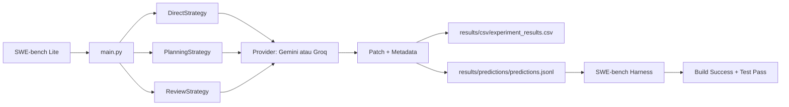

# AgentBench-SE

> Analisis trade-off tiga strategi orkestrasi AI Agent (Direct, Planning, Planning+Review) untuk tugas bug fixing otomatis pada dataset SWE-bench Lite.

## Daftar Isi

- [Tentang Proyek](#tentang-proyek)
- [Arsitektur Singkat](#arsitektur-singkat)
- [Strategi yang Dibandingkan](#strategi-yang-dibandingkan)
- [Struktur Proyek](#struktur-proyek)
- [Prasyarat](#prasyarat)
- [Instalasi](#instalasi)
- [Konfigurasi](#konfigurasi)
- [Penggunaan](#penggunaan)
- [Hasil Eksperimen](#hasil-eksperimen)
- [Dokumentasi Terkait](#dokumentasi-terkait)

## Tentang Proyek

AgentBench-SE adalah eksperimen perangkat lunak yang membandingkan tiga strategi orkestrasi agent dalam menyelesaikan isu *bug fixing* Python. Setiap strategi memakai model AI yang sama (Gemini atau Groq) sehingga perbedaan hasil murni dipengaruhi oleh struktur orkestrasi.

Tujuan riset:

- **RQ1** — Efektivitas: Build Success Rate dan Test Pass Rate antar strategi.
- **RQ2** — Efisiensi: Total execution time dan inference count.
- **RQ3** — Trade-off: prompt tokens, completion tokens, total tokens.

Dataset: [princeton-nlp/SWE-bench_Lite](https://huggingface.co/datasets/princeton-nlp/SWE-bench_Lite) (subset repo Django).

## Arsitektur Singkat



## Strategi yang Dibandingkan

| Kode | Strategi | Alur Agent | Inferensi |
|:----:|:---------|:-----------|:---------:|
| **S1** | Direct Execution | `Issue -> Executor -> Patch` | 1 |
| **S2** | Planning-based | `Issue -> Planner -> Executor -> Patch` | 2 |
| **S3** | Planning + Review | `Issue -> Planner -> Executor -> Reviewer -> (Executor Revisi) -> Patch` | 3-4 |

Trade-off inti: semakin banyak agent, semakin tinggi biaya (token + waktu) namun potensi efektivitas lebih besar.

## Struktur Proyek

```
AgantBech-SE/
├── src/
│   ├── main.py                 # CLI entry point
│   ├── config.py               # Loader .env
│   ├── dataset_loader.py       # Filter SWE-bench Lite
│   ├── view_results.py         # Inspeksi hasil
│   ├── providers/              # GeminiProvider, GroqProvider
│   ├── strategies/             # Direct, Planning, Review
│   ├── experiments/            # Runner + SWE-bench adapter
│   ├── evaluation/             # Evaluator
│   └── prompts/                # Template prompt per role
├── datasets/                   # Cache HuggingFace
├── docs/                       # Setup, technical, feedback
├── results/
│   ├── csv/                    # experiment_results.csv
│   ├── patches/                # Raw patch per issue
│   ├── predictions/            # predictions.jsonl
│   └── logs/
├── graphify-out/               # Knowledge graph (auto-generated)
├── logs/
├── sdd.md                      # Spec-Driven Development
├── requirements.txt
└── .env                        # API keys (tidak di-commit)
```

## Prasyarat

- Python 3.10+
- pip
- (Opsional) Docker Desktop — hanya bila ingin menjalankan SWE-bench harness evaluasi
- API key untuk salah satu provider:
  - `GEMINI_API_KEY` (utama)
  - `GROQ_API_KEY` (fallback development)

## Instalasi

```powershell
git clone <url-repo> AgantBech-SE
cd AgantBech-SE
python -m venv .venv
.venv\Scripts\activate
pip install -r requirements.txt
```

## Konfigurasi

Buat file `.env` di root proyek:

```env
GEMINI_API_KEY=your_gemini_key
GEMINI_MODEL=gemini-3-flash-preview

GROQ_API_KEY=your_groq_key
GROQ_MODEL=llama-3.3-70b-versatile

TEMPERATURE=0.2
MAX_RETRIES=3
USD_IDR_RATE=16500.0
```

> [!NOTE]
> Untuk konsistensi riset, eksperimen utama memakai Gemini. Groq hanya untuk iterasi cepat saat development.

## Penggunaan

### 1. Jalankan eksperimen

```powershell
# Dry run (2 issue, ~5 menit)
python src/main.py --n-issues 2 --output results/dry_run

# Full run (15 issue, ~45 menit)
python src/main.py --n-issues 15 --output results/full_run

# Pakai Groq sebagai fallback
python src/main.py --provider groq --n-issues 10
```

Opsi CLI:

| Argumen | Default | Keterangan |
|:--------|:--------|:-----------|
| `--repo` | `django` | Filter repo SWE-bench |
| `--n-issues` | `15` | Jumlah issue yang diproses |
| `--provider` | `groq` | `gemini` atau `groq` |
| `--output` | `results` | Direktori output |
| `--rate-limit` | `1.5` | Delay antar strategi (detik) |

### 2. Inspeksi hasil

```powershell
python src/view_results.py summary
python src/view_results.py compare
python src/view_results.py errors
```

Output:

- `results/<run>/csv/experiment_results.csv` — metrik per issue per strategi.
- `results/<run>/predictions/predictions.jsonl` — patch siap evaluasi SWE-bench.
- `results/<run>/experiment.yaml` — konfigurasi eksperimen untuk reproduksibilitas.
- `results/<run>/patches/<instance>_<strategy>.txt` — raw response per strategi.

### 3. Evaluasi SWE-bench (opsional, butuh Docker)

```powershell
python -m swebench.harness.run_evaluation `
    --predictions_path results/full_run/predictions/predictions.jsonl `
    --max_workers 1 `
    --run_id agentbench-full
```

> [!WARNING]
> Build image Docker untuk SWE-bench butuh 30-60 menit dan RAM besar. Lewati langkah ini bila hanya butuh metrik internal (execution time, token, inference count).

## Hasil Eksperimen

Metrik yang dikumpulkan per strategi per issue:

- `execution_time` — total waktu (detik)
- `inference_count` — jumlah panggilan API
- `prompt_tokens`, `completion_tokens`, `total_tokens`
- `patch_preview` — 100 karakter pertama patch
- `error` — error string bila gagal

Ringkasan rata-rata dicetak di akhir run. Untuk analisis RQ1-RQ3, lihat `sdd.md` dan folder `docs/`.

## Dokumentasi Terkait

- [`sdd.md`](./sdd.md) — Spec-Driven Development lengkap (arsitektur, role, trade-off, runbook).
- [`docs/setup-guide.md`](./docs/setup-guide.md) — Setup environment Windows + WSL2 + Docker.
- [`docs/TECHNICAL.md`](./docs/TECHNICAL.md) — Catatan teknis komponen.
- [`docs/FEEDBACK.md`](./docs/FEEDBACK.md) — Tanggapan atas kritik dosen pembimbing.
- [`graphify-out/`](./graphify-out) — Knowledge graph proyek (auto-generated).