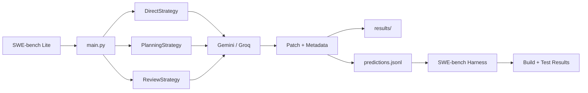

# AgentBench-SE

> Eksperimen perbandingan tiga strategi orkestrasi AI Agent (Direct, Planning, Planning+Review) untuk *automated bug fixing* pada dataset [SWE-bench Lite](https://huggingface.co/datasets/princeton-nlp/SWE-bench_Lite).

[](https://www.python.org/downloads/)
[](https://huggingface.co/datasets/princeton-nlp/SWE-bench_Lite)
[](LICENSE)

## Daftar Isi

- [Tentang Proyek](#tentang-proyek)
- [Fitur](#fitur)
- [Arsitektur](#arsitektur)
- [Strategi yang Dibandingkan](#strategi-yang-dibandingkan)
- [Struktur Proyek](#struktur-proyek)
- [Prasyarat & Instalasi](#prasyarat--instalasi)
- [Konfigurasi](#konfigurasi)
- [Penggunaan](#penggunaan)
- [Dokumentasi Terkait](#dokumentasi-terkait)

## Tentang Proyek

AgentBench-SE membandingkan tiga strategi orkestrasi agent dalam menyelesaikan *bug fixing* Python. Setiap strategi memakai model AI yang sama (Gemini atau Groq) sehingga perbedaan hasil murni dipengaruhi oleh struktur orkestrasi.

**Research Questions:**

| RQ | Fokus | Metrik |
|:---|:------|:-------|
| RQ1 | Efektivitas | Build Success Rate, Test Pass Rate |
| RQ2 | Efisiensi | Execution Time, Inference Count |
| RQ3 | Trade-off | Prompt Tokens, Completion Tokens, Total Tokens |

## Fitur

- **3 Strategi Orkestrasi** — Direct (1 inferensi), Planning (2 inferensi), Planning+Review (3-4 inferensi)
- **Multi Provider** — Gemini (utama) dan Groq (fallback/dev)
- **Patch Validation** — Auto-validasi syntax diff sebelum export, filter patch invalid/terpotong
- **SWE-bench Integration** — Export `predictions.jsonl` siap evaluasi dengan Docker harness
- **Reproducible Experiments** — Setiap run menghasilkan `experiment.yaml`, CSV, dan artifact per-issue

## Arsitektur



## Strategi yang Dibandingkan

| Kode | Strategi | Alur Agent | Inferensi |
|:----:|:---------|:-----------|:---------:|
| **S1** | Direct Execution | `Issue -> Executor -> Patch` | 1 |
| **S2** | Planning-based | `Issue -> Planner -> Executor -> Patch` | 2 |
| **S3** | Planning + Review | `Issue -> Planner -> Executor -> Reviewer -> (Revisi) -> Patch` | 3-4 |

> [!TIP]
> Trade-off inti: semakin banyak agent, semakin tinggi biaya (token + waktu) namun potensi efektivitas lebih besar.

## Struktur Proyek

```
AgantBech-SE/
├── src/
│   ├── main.py                 # CLI entry point
│   ├── config.py               # Loader .env
│   ├── dataset_loader.py       # Filter SWE-bench Lite
│   ├── providers/              # GeminiProvider, GroqProvider
│   ├── strategies/             # Direct, Planning, Review
│   ├── experiments/            # Runner + SWE-bench adapter
│   ├── evaluation/             # Cost calculator + retry
│   └── prompts/                # Template prompt per role
├── tests/                      # Unit tests
├── docs/                       # Setup, technical, feedback
├── results/                    # Output per run
│   ├── csv/                    # experiment_results.csv
│   ├── patches/                # Raw patch per issue
│   └── predictions/            # predictions.jsonl
├── sdd.md                      # Spec-Driven Development
└── requirements.txt
```

## Prasyarat & Instalasi

### Prasyarat

- Python 3.10+
- API key (minimal satu): `GEMINI_API_KEY`, `DEEPSEEK_API_KEY`, atau `GROQ_API_KEY`
- (Opsional) Docker — hanya untuk SWE-bench harness evaluasi

### Instalasi

```powershell
git clone <url-repo> AgantBech-SE
cd AgantBech-SE
python -m venv .venv
.venv\Scripts\activate
pip install -r requirements.txt
```

## Konfigurasi

Buat file `.env` di root proyek:

```env
GEMINI_API_KEY=your_gemini_key
GEMINI_MODEL=gemini-3-flash-preview

GROQ_API_KEY=your_groq_key
GROQ_MODEL=llama-3.3-70b-versatile

DEEPSEEK_API_KEY=your_deepseek_key
DEEPSEEK_MODEL=deepseek-v4-flash

TEMPERATURE=0.2
MAX_RETRIES=3
USD_IDR_RATE=16500.0
```

> [!NOTE]
> Untuk konsistensi riset, eksperimen utama memakai Gemini. DeepSeek dan Groq untuk iterasi cepat saat development atau bila Gemini kena rate limit.

> [!TIP]
> DeepSeek V4 Flash: input $0.14/1M (cache hit $0.0028), output $0.28/1M. Murah dan cepat untuk eksperimen skala besar.

## Penggunaan

### Jalankan eksperimen

```powershell
# Dry run (2 issue, ~5 menit)
python src/main.py --n-issues 2 --output results/dry_run

# Full run (15 issue, ~45 menit)
python src/main.py --n-issues 15 --output results/full_run

# Pakai Groq
python src/main.py --provider groq --n-issues 10

# Pakai DeepSeek
python src/main.py --provider deepseek --n-issues 10
```

### Opsi CLI

| Argumen | Default | Keterangan |
|:--------|:--------|:-----------|
| `--repo` | `django` | Filter repo SWE-bench |
| `--n-issues` | `15` | Jumlah issue yang diproses |
| `--provider` | `gemini` | Provider AI: `gemini`, `deepseek`, atau `groq` |
| `--output` | `results` | Direktori output |
| `--rate-limit` | `1.5` | Delay antar strategi (detik) |

### Inspeksi hasil

```powershell
python src/view_results.py summary
python src/view_results.py compare
python src/view_results.py errors
```

### Evaluasi SWE-bench (opsional)

```powershell
python -m swebench.harness.run_evaluation `
    --predictions_path results/full_run/predictions/predictions.jsonl `
    --max_workers 1 `
    --run_id agentbench-full
```

> [!WARNING]
> Build image Docker untuk SWE-bench butuh 30-60 menit dan RAM besar. Lewati langkah ini bila hanya butuh metrik internal (execution time, token, inference count).

## Output

| File | Keterangan |
|:-----|:-----------|
| `results/<run>/csv/experiment_results.csv` | Metrik per issue per strategi |
| `results/<run>/predictions/predictions.jsonl` | Patch siap evaluasi SWE-bench |
| `results/<run>/experiment.yaml` | Konfigurasi eksperimen untuk reproduksibilitas |
| `results/<run>/patches/<instance>_<strategy>.txt` | Raw response LLM per strategi |

## Dokumentasi Terkait

- [`sdd.md`](./sdd.md) — Spec-Driven Development lengkap (arsitektur, role, trade-off, runbook)
- [`docs/setup-guide.md`](./docs/setup-guide.md) — Setup environment Windows + WSL2 + Docker
- [`docs/TECHNICAL.md`](./docs/TECHNICAL.md) — Catatan teknis komponen
- [`docs/FEEDBACK.md`](./docs/FEEDBACK.md) — Tanggapan atas kritik dosen pembimbing
