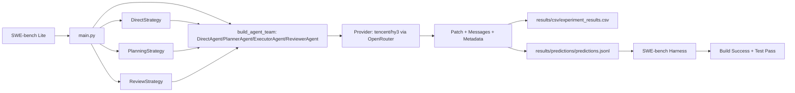

# AgentBench-SE

> Analisis trade-off tiga strategi orkestrasi AI Agent (Direct, Planning, Planning+Review) untuk tugas bug fixing otomatis pada dataset SWE-bench Lite.

## Daftar Isi

- [Tentang Proyek](#tentang-proyek)
- [Arsitektur Singkat](#arsitektur-singkat)
- [Strategi yang Dibandingkan](#strategi-yang-dibandingkan)
- [Struktur Proyek](#struktur-proyek)
- [Prasyarat](#prasyarat)
- [Instalasi](#instalasi)
- [Konfigurasi](#konfigurasi)
- [Penggunaan](#penggunaan)
- [Hasil Eksperimen](#hasil-eksperimen)
- [Dokumentasi Terkait](#dokumentasi-terkait)

## Tentang Proyek

AgentBench-SE adalah eksperimen perangkat lunak yang membandingkan tiga strategi orkestrasi agent dalam menyelesaikan isu *bug fixing* Python. Setiap strategi memakai model AI yang sama (tencent/hy3) sehingga perbedaan hasil murni dipengaruhi oleh struktur orkestrasi.

Tujuan riset:

- **RQ1** — Efektivitas: Build Success Rate dan Test Pass Rate antar strategi.
- **RQ2** — Efisiensi: Total execution time dan inference count.
- **RQ3** — Trade-off: prompt tokens, completion tokens, total tokens.

Dataset: [princeton-nlp/SWE-bench_Lite](https://huggingface.co/datasets/princeton-nlp/SWE-bench_Lite) (subset repo Django).

## Arsitektur Singkat


```mermaid
flowchart LR
    A[SWE-bench Lite] --> B[main.py]
    B --> T[build_agent_team: DirectAgent/PlannerAgent/ExecutorAgent/ReviewerAgent]
    B --> C1[DirectStrategy]
    B --> C2[PlanningStrategy]
    B --> C3[ReviewStrategy]
    C1 --> T
    C2 --> T
    C3 --> T
    T --> P[Provider: tencent/hy3 via OpenRouter]
    P --> D[Patch + Messages + Metadata]
    D --> E[results/csv/experiment_results.csv]
    D --> F[results/predictions/predictions.jsonl]
    F --> G[SWE-bench Harness]
    G --> H[Build Success + Test Pass]
```

> [!NOTE]
> Sejak branch `19/feat/multi-agent-orchestration`, setiap role (direct, planner, executor, reviewer) adalah **agent object sungguhan** dengan message passing via `Blackboard`. Jejak komunikasi antar agent disimpan di `artifacts/<instance_id>/messages.jsonl`.

## Strategi yang Dibandingkan

| Kode | Strategi | Alur Agent | Inferensi |
|:----:|:---------|:-----------|:---------:|
| **S1** | Direct Execution | `Issue -> Executor -> Patch` | 1 |
| **S2** | Planning-based | `Issue -> Planner -> Executor -> Patch` | 2 |
| **S3** | Planning + Review | `Issue -> Planner -> Executor -> Reviewer -> (Executor Revisi) -> Patch` | 3-4 |

Trade-off inti: semakin banyak agent, semakin tinggi biaya (token + waktu) namun potensi efektivitas lebih besar.

## Struktur Proyek

```text
AgantBech-SE/
├── agentbench/                 # Package interactive shell (baru, sejak branch 20)
│   ├── cli/main.py             # Entry: `agentbench` & `agentbench setup`
│   ├── shell.py                # REPL (cmd.Cmd) — banner, help, command dispatch
│   ├── config_manager.py       # YAML config ~/.agentbench/config.yaml
│   ├── setup_wizard.py         # Wizard interaktif `agentbench setup`
│   ├── commands/               # run, results, export, config, provider, dataset, artifacts
│   ├── ui/                     # banner, progress, tables (rich)
│   └── core/                   # EXISTING src/ (di-rename ke sini)
│       ├── main.py             # CLI entry point legacy
│       ├── config.py           # Loader .env
│       ├── dataset_loader.py   # Filter SWE-bench Lite
│       ├── view_results.py     # Inspeksi hasil
│       ├── models/             # Issue, Patch, InferenceResult/Run, ExperimentResult
│       ├── agents/             # Layer multi-agent (sejak branch 19)
│       ├── providers/          # OpenRouter, Gemini, Groq, OpenCode
│       ├── strategies/         # Direct, Planning, Review
│       ├── experiments/        # Runner + SWE-bench adapter + observability
│       ├── evaluation/         # Cost, retry, statistics, evaluator
│       └── prompts/            # Template prompt per agent
├── src/                        # Shim backward-compat (main.py, view_results.py)
├── datasets/                   # Cache HuggingFace
├── docs/                       # Setup, technical, PRD/SDD interactive shell
├── results/
│   ├── csv/                    # experiment_results.csv
│   ├── patches/                # Raw patch per issue
│   ├── predictions/            # predictions.jsonl
│   └── <EXP-ID>/artifacts/     # Per-agent .md + messages.jsonl per issue
├── graphify-out/               # Knowledge graph (auto-generated)
├── logs/
├── sdd.md                      # Spec-Driven Development
├── setup.py                    # Packaging (entry point `agentbench`)
├── requirements.txt
└── .env                        # API keys (tidak di-commit)
```

> [!NOTE]
> `src/` telah di-rename ke `agentbench/core/` (SDD Interactive Shell §7).
> `src/main.py` & `src/view_results.py` tetap ada sebagai **shim** agar perintah
> legacy `python src/main.py ...` masih berfungsi.

## Prasyarat

- Python 3.10+
- pip
- (Opsional) Docker Desktop — hanya bila ingin menjalankan SWE-bench harness evaluasi
- API key untuk OpenRouter:
  - `OPENROUTER_API_KEY` (utama — model: `tencent/hy3`)

## Instalasi

```powershell
git clone <url-repo> AgantBech-SE
cd AgantBech-SE
python -m venv .venv
.venv\Scripts\activate
pip install -r requirements.txt

# (Opsional) install sebagai package — menyediakan perintah `agentbench`
pip install -e .
```

## Konfigurasi

### Opsi A — Wizard interaktif (disarankan)

```powershell
agentbench setup
```

Wizard memandu: info peneliti → pilih provider → API key → model → pengaturan
eksperimen (temperature, retries, rate limit, kurs USD/IDR) → tes koneksi.
Hasilnya disimpan ke `~/.agentbench/config.yaml`.

### Opsi B — Manual (`.env`, legacy)

Buat file `.env` di root proyek:

```env
OPENROUTER_API_KEY=your_openrouter_key
OPENROUTER_MODEL=tencent/hy3:free

TEMPERATURE=0.2
MAX_RETRIES=3
USD_IDR_RATE=16500.0
```

> [!NOTE]
> Untuk konsistensi riset, eksperimen utama memakai OpenRouter (`tencent/hy3`).
> API key pada `~/.agentbench/config.yaml` disimpan plain text — jangan commit
> file tersebut.

## Interactive Shell

Jalankan `agentbench` (tanpa argumen) untuk masuk ke REPL:

```powershell
agentbench
```

```text
╭──────────────────────────────────────────────────────────╮
│ 🧪 AgentBench-SE Interactive Shell                       │
│ Framework for AI Agent Orchestration Strategy Evaluation │
│ Version 0.1.0 | Research by <nama>                       │
╰──────────────────────────────────────────────────────────╯
agentbench>
```

### Perintah

| Perintah | Kegunaan |
|:---------|:---------|
| `run [--issues N] [--strategy S] [--output DIR] [--resume]` | Jalankan eksperimen dengan progress bar live |
| `results summary` | Ringkasan metrik per strategi |
| `results compare` | Perbandingan strategi side-by-side |
| `results errors` | Daftar issue gagal |
| `results patch <issue_id> [--strategy S]` | Tampilkan patch sebuah issue |
| `export [--format csv\|json\|markdown] [--output PATH]` | Ekspor hasil |
| `config show` / `config set <key> <value>` / `config reset` | Kelola konfigurasi |
| `provider [--test]` | Info provider / uji koneksi |
| `dataset [--refresh]` | Info dataset (repo & difficulty) |
| `artifacts <issue_id> <strategy>` | Lihat artifact per agent |
| `info`, `version`, `help [cmd]` | Info framework & bantuan |
| `exit` / `quit` / `Ctrl+D` | Keluar |

Contoh sesi:

```text
agentbench> run --issues 10 --strategy all
agentbench> results summary
agentbench> export --format markdown --output thesis_appendix.md
agentbench> exit
```

> [!NOTE]
> Perintah legacy `python src/main.py --issues 2` dan
> `python src/view_results.py summary` tetap berfungsi (shim backward-compat).

## Penggunaan

### 1. Jalankan eksperimen

```powershell
# Dry run (2 issue, ~5 menit)
python src/main.py --issues 2 --output results/dry_run

# Full run (50 issue, ~2 jam)
python src/main.py --output results/full_run

# Resume dari run sebelumnya
python src/main.py --resume --output results/full_run

# Pakai Groq sebagai fallback
python src/main.py --provider groq --issues 10

# Override sampling repo secara spesifik
python src/main.py --repo-spec django/django=10 --repo-spec psf/requests=5 --issues 6
```

Opsi CLI:

| Argumen | Default | Keterangan |
|:--------|:--------|:-----------|
| `--output` | `results` | Direktori output |
| `--provider` | `gemini` | `gemini`, `groq`, `opencode`, `openrouter` |
| `--issues` | (semua 50) | Batas jumlah issue untuk testing |
| `--resume` | `False` | Lanjutkan dari run sebelumnya |
| `--rate-limit` | `1.5` | Delay antar strategi (detik) |
| `--repo-spec` | (default repo mix) | Override sampling repo, format `repo=count` |

### 2. Inspeksi hasil

```powershell
python src/view_results.py summary
python src/view_results.py compare
python src/view_results.py errors
```

Output:

- `results/<EXP-ID>/results.csv` — metrik per issue per strategi.
- `results/<EXP-ID>/predictions/predictions.jsonl` — patch siap evaluasi SWE-bench.
- `results/<EXP-ID>/experiment.yaml` — konfigurasi eksperimen untuk reproduksibilitas.
- `results/<EXP-ID>/manifest.json` — ringkasan dataset, provider, dan strategi yang digunakan.
- `results/<EXP-ID>/artifacts/` — output per-agent (planner/executor/reviewer) per issue.
- `results/<EXP-ID>/artifacts/<instance_id>/<strategy>_summary.json` — ringkasan run per issue per strategi.

### 3. Evaluasi SWE-bench (opsional, butuh Docker)

```powershell
python -m swebench.harness.run_evaluation `
    --predictions_path results/full_run/predictions/predictions.jsonl `
    --max_workers 1 `
    --run_id agentbench-full
```

> [!WARNING]
> Build image Docker untuk SWE-bench butuh 30-60 menit dan RAM besar. Lewati langkah ini bila hanya butuh metrik internal (execution time, token, inference count).

## Hasil Eksperimen

Metrik yang dikumpulkan per strategi per issue:

- `execution_time` — total waktu (detik)
- `inference_count` — jumlah panggilan API
- `prompt_tokens`, `completion_tokens`, `total_tokens`
- `patch_preview` — 100 karakter pertama patch
- `error` — error string bila gagal

Ringkasan rata-rata dicetak di akhir run. Untuk analisis RQ1-RQ3, lihat `sdd.md` dan folder `docs/`.

## Dokumentasi Terkait

- [`sdd.md`](./sdd.md) — Spec-Driven Development (arsitektur, role, trade-off, runbook).
- [`docs/MULTI_AGENT_MIGRATION.md`](./docs/MULTI_AGENT_MIGRATION.md) — Rencana & implementasi migrasi Single-role → Multi-Agent Orchestration.
- [`docs/SRS.md`](./docs/SRS.md) — Software Requirements Specification (SA/DD).
- [`docs/DSR_MAPPING.md`](./docs/DSR_MAPPING.md) — Design Science Research Mapping (SA/DD).
- [`docs/USE_CASE_SPEC.md`](./docs/USE_CASE_SPEC.md) — Use Case Specification (SA/DD).
- [`docs/RTM.md`](./docs/RTM.md) — Requirement Traceability Matrix (SA/DD).
- [`docs/SYSTEM_VALIDATION.md`](./docs/SYSTEM_VALIDATION.md) — System Validation Report (SA/DD).
- [`docs/FEEDBACK.md`](./docs/FEEDBACK.md) — Tanggapan atas kritik dosen pembimbing.
- [`docs/TECHNICAL.md`](./docs/TECHNICAL.md) — Catatan teknis komponen.
- [`graphify-out/`](./graphify-out) — Knowledge graph proyek (auto-generated).