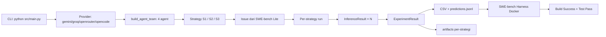

# Framework Flow Penelitian — AgentBench-SE

**Tanggal**: 2026-07-31
**Audiens**: Dosen pembimbing, sidang skripsi
**Cabang**: `19/feat/multi-agent-orchestration`
**Referensi**: `sdd.md`, `docs/MULTI_AGENT_MIGRATION.md`, `docs/SRS.md`

---

## 1. Tujuan

Dokumen ini menjelaskan alur lengkap eksekusi eksperimen AgentBench-SE sejak inisialisasi CLI hingga keluaran SWE-bench Harness, dengan fokus pada tiga strategi orkestrasi (S1–S3) dan layer multi-agent yang membungkus strategi.

## 2. Pertanyaan Riset (RQ)

- **RQ1** — Efektivitas: Build Success Rate, Test Pass Rate antar strategi.
- **RQ2** — Efisiensi: Total execution time, inference count.
- **RQ3** — Trade-off: Prompt tokens, completion tokens, total tokens, cost.

## 3. Diagram Besar End-to-End

## 4. Tahapan Eksekusi

### 4.1 Inisialisasi (sekali per run)

Lokasi: `src/main.py:155-205`

1. Parse CLI args.
2. Pilih Provider (`gemini|groq|openrouter|opencode`) — `main.py:158-167`.
3. Health check provider — `main.py:168`.
4. Load SWE-bench Lite, filter repo — `main.py:172-180`.
5. Bangun agent team: `agent_team = build_agent_team(provider)` — `main.py:182`.
6. Bangun map strategi: `DirectStrategy`, `PlanningStrategy`, `ReviewStrategy` — `main.py:188-192`.
7. Generate experiment ID (mis. `EXP-20260731-004`) — `runner.py:103` via `experiment_id.generate_experiment_id()`.
8. Buat directory eksperimen: `results/<EXP-ID>/{artifacts,logs}`.
9. Panggil `run_experiments(issues, strategies, base_dir, provider_name, rate_limit, resume, agents)` — `main.py:197`.

### 4.2 Loop Per Issue × Strategi

Lokasi: `src/experiments/runner.py:131-260`

Untuk setiap `issue` dan setiap `strategy`:
- **Load issue** (`Issue` dari `models/issue.py`).
- **Panggil `strategy.run(issue)`** → `Patch` + `ExperimentResult`.
- **Ekstrak diff** dengan `swebench_adapter.extract_diff()`.
- **Append jsonl savepoint** ke `predictions/<strategy>.jsonl` dan `predictions.jsonl`.
- **Simpan artifact** ke `artifacts/<instance_id>/<strategy_name>/` (lihat 4.3).
- **Tulis summary** ke `artifacts/<instance_id>/<strategy_name>/summary.json`.
- **Rate-limit delay** random 10–15 detik.

### 4.3 Komposisi Agent (S1–S3)

Setiap strategi adalah supervisor yang mengkoordinasikan subset dari `agent_team`.

**S1 — Direct Execution** (`src/strategies/direct_strategy.py`):
- 1 agent: `DirectAgent`.
- 1 inference, 1 pesan.
- BB: `issue` → `direct` → `patch`.

**S2 — Planning** (`src/strategies/planning_strategy.py`):
- 2 agent: `PlannerAgent` → `ExecutorAgent`.
- 2 inference, 2 pesan.
- BB: `issue` → `planner` → `bb.plan` → `executor` (dengan `bb.plan`) → `bb.patch`.

**S3 — Planning + Review** (`src/strategies/review_strategy.py`):
- 3–4 agent: `PlannerAgent` → `ExecutorAgent` → `ReviewerAgent` → (opsional) `ExecutorAgent` revisi.
- 3–4 inference, 3–4 pesan.
- Revisi bila `_extract_verdict(review_response) != "APPROVED"`.

### 4.4 Agent sebagai Worker

Lokasi: `src/agents/base.py:25-35` (`act()`)

Setiap agent:
1. Render template (`_render` di subclass) — substitusi `{{issue}}`, `{{plan}}`, `{{feedback}}`.
2. Panggil provider — 1 inference.
3. Bentuk `AgentMessage` balikan (sender=agent, receiver=pengirim task).
4. Catat ke `Blackboard.history` lewat `context.log()`.
5. Return `AgentResponse(message, inference)`.

### 4.5 Blackboard

Lokasi: `src/agents/blackboard.py`

Shared state per-issue: `issue`, `plan`, `patch`, `feedback`, `revision`, `history`. Semua cell dapat dimutasi hanya oleh strategi (bukan agent). Agent cuma `log()` ke `history`.

### 4.6 Observability

| Output | Lokasi | Tujuan |
|---|---|---|
| `results/<EXP>/results.csv` | `runner.py:281` | Metrik per (issue × strategi) |
| `results/<EXP>/predictions.jsonl` | `runner.py:188-194` | Input untuk SWE-bench Harness |
| `results/<EXP>/predictions/<strategy>.jsonl` | `runner.py:185-189` | Input parsial per strategi |
| `results/<EXP>/statistics.json` | `runner.py:287` | Agregasi metrik |
| `results/<EXP>/summary.md` | `runner.py:291` | Ringkasan manusiawi |
| `results/<EXP>/manifest.json` | `runner.py:303` | Info dataset + provider + agents |
| `results/<EXP>/experiment.yaml` | `main.py:209` | Reproducibility |
| `results/<EXP>/artifacts/<instance>/<strategy>/<role>.md` | `runner.py:46-49` | Output per agent |
| `results/<EXP>/artifacts/<instance>/<strategy>/patch.txt` | `runner.py:51` | Patch final |
| `results/<EXP>/artifacts/<instance>/<strategy>/messages.jsonl` | `runner.py:53-56` | Jejak message passing |
| `results/<EXP>/artifacts/<instance>/<strategy>/summary.json` | `observability.py:43-69` | Ringkasan per-run |
| `logs/<EXP>/experiment.log` | `runner.py:115-117` | Log eksekusi |

## 5. Evaluasi SWE-bench

Lokasi downstream: `tools/EVAL_INSTRUCTIONS.md`, `tools/setup_and_eval.sh`, `tools/run_eval.sh`.

1. Copy `results/<EXP>/predictions/` ke mesin dengan WSL2/Ubuntu (perlu Docker, 4GB+ RAM).
2. `python -m swebench.harness.run_evaluation --predictions_path results/<EXP>/predictions/predictions.jsonl --max_workers 1 --run_id <RUN_ID>`.
3. Output: `logs/run_evaluation/<RUN_ID>/` + JSON ringkasan (resolved/unresolved).
4. Build Success Rate + Test Pass Rate → jawaban RQ1.

## 6. Kontribusi Multi-Agent ke Riset

Variabel yang diukur (RQ1–RQ3) **tidak berubah** karena jumlah inference, prompt, dan cost identik dengan arsitektur single-prompt. Kontribusi baru:

- **Observability**: `messages.jsonl` memungkinkan analisis komunikasi intra-orchestration (siapa kirim ke siapa, kapan).
- **Reusability**: 4 agent didefinisikan sekali, dikomposisi ulang per strategi.
- **Extensibility**: Menambah strategi (mis. `S4_Debate`) = menambah kelas strategi baru saja, agent_team + blackboard tetap.

## 7. Validasi Riset

- `pytest` (52 test) memverifikasi parity perilaku (S1=1, S2=2, S3=3-4 inference).
- `experiment.yaml` + `manifest.json` menjamin reproducibility.
- SWE-bench Harness (post-eksperimen) memberikan ground-truth efektivitas.
