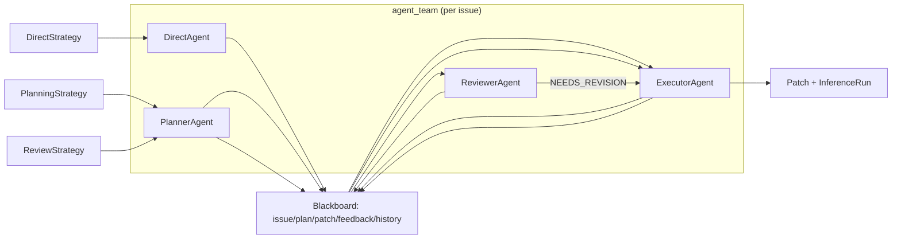

# Rencana Migrasi Multi-Agent Orchestration

**Tanggal**: 2026-07-31
**Status**: ✅ Implementasi Selesai (branch `19/feat/multi-agent-orchestration`)
**Referensi**: `sdd.md` (S1–S3), `PLAN.md`

---

## 1. Latar Belakang

Implementasi saat ini memakai **1 provider LLM yang sama** dengan `role` hanya berupa label string pada tiap panggilan `provider.generate(prompt, role=...)`. Tidak ada entitas agent, tidak ada message passing, tidak ada state bersama. Migrasi ini mengubah implementasi menjadi **orchestrasi multi-agent sungguhan** dengan 4 agent (direct, planner, executor, reviewer) tanpa mengubah struktur riset S1–S3, dataset, provider, model, maupun RQ.

## 2. Kondisi Saat Ini

| Aspek | Sekarang |
|---|---|
| Orkestrasi | Script berantai di `src/strategies/*.py` |
| Agent | Tidak ada — hanya label `role` |
| Komunikasi | Stateless, satu arah per panggilan |
| State | Tidak ada (tiap panggilan fresh prompt) |
| Observability | `InferenceRun` menampung `InferenceResult` per role |

Kode terkait:
- `src/strategies/review_strategy.py:32-62`
- `src/strategies/planning_strategy.py:18-28`
- `src/strategies/direct_strategy.py:16-17`
- `src/experiments/runner.py:46-51`

## 3. Arsitektur Target

Konsep kunci:
- **Agent**: objek dengan `name`, `prompt_file`, `provider`, `act(AgentMessage) → AgentResponse`. Setiap `act()` = 1 panggilan LLM yang merekam `InferenceResult`.
- **Blackboard**: shared state per issue (`plan`, `patch`, `feedback`, `history` = jejak pesan antar agent).
- **Strategi**: komposisi agent dari `agent_team`, bukan pemanggil provider langsung.

## 4. File Baru

| File | Isi |
|---|---|
| `src/agents/__init__.py` | Ekspor publik |
| `src/agents/messages.py` | `AgentMessage` (sender, receiver, content, kind, timestamp) |
| `src/agents/blackboard.py` | `Blackboard` (state + `log()` pesan) |
| `src/agents/base.py` | `BaseAgent` abstrak (`_render`, `act`) + `AgentResponse` |
| `src/agents/direct_agent.py` | Render `direct_prompt.md` ({{issue}}) |
| `src/agents/planner_agent.py` | Render `planner.md` ({{issue}}) |
| `src/agents/executor_agent.py` | Render `executor.md` ({{issue}} + {{plan}}; mode revisi bila `bb.feedback` ada → {{feedback}}) |
| `src/agents/reviewer_agent.py` | Render `reviewer.md` ({{issue}} + {{plan}} + {{patch}}) |
| `src/agents/registry.py` | `build_agent_team(provider) -> dict[str, BaseAgent]` |
| `tests/test_agents.py` | Unit test render + rekam inference tiap agent |

Kontrak: `provider.generate(prompt, role=agent.name) → InferenceResult` tetap dipakai → `InferenceRun`, cost, observability tidak berubah.

## 5. File Diubah

| File | Perubahan |
|---|---|
| `src/strategies/direct_strategy.py` | Gunakan `direct_agent` dari team |
| `src/strategies/planning_strategy.py` | `planner_agent` → `executor_agent` via `Blackboard` |
| `src/strategies/review_strategy.py` | `planner` → `executor` → `reviewer` → revisi `executor` (parity: 1 revisi) |
| `src/main.py` | Strategi dibangun dari `build_agent_team`; manifest + experiment.yaml memuat daftar agent |
| `src/experiments/runner.py` (`_save_artifacts`) | File per-role termasuk `direct.md`; tambah `messages.jsonl` (jejak message passing) |
| `src/experiments/observability.py` | Manifest tambah `agents` (nama + prompt file) |
| `tests/test_review_strategy.py` | Sesuaikan asersi (role direct berubah menjadi `"direct"`) |
| `sdd.md`, `README.md` | Dokumentasikan layer agent |

Catatan: label role direct berubah `"executor"` → `"direct"` — berdampak pada nama file artifact direct saja; CSV/token/cost tidak terpengaruh.

## 6. Implementation Todo

- [x] Fase 1 — Foundation
  - [x] `src/agents/messages.py` — `AgentMessage`
  - [x] `src/agents/blackboard.py` — `Blackboard`
  - [x] `src/agents/base.py` — `BaseAgent` + `AgentResponse`
- [x] Fase 2 — Agent konkret
  - [x] `src/agents/direct_agent.py`
  - [x] `src/agents/planner_agent.py`
  - [x] `src/agents/executor_agent.py`
  - [x] `src/agents/reviewer_agent.py`
  - [x] `src/agents/registry.py`
  - [x] `tests/test_agents.py` + run `pytest`
- [x] Fase 3 — Refactor strategi
  - [x] `direct_strategy.py` → `direct_agent`
  - [x] `planning_strategy.py` → `planner_agent` + `executor_agent`
  - [x] `review_strategy.py` → chain + revisi loop
  - [x] `tests/test_review_strategy.py` update; verifikasi parity inferensi (S1=1, S2=2, S3=3–4)
- [x] Fase 4 — Wiring & observability
  - [x] `main.py` pakai `build_agent_team`
  - [x] `runner.py` `_save_artifacts` + `messages.jsonl`
  - [x] `observability.py` manifest `agents`
- [x] Fase 5 — Verifikasi
  - [x] `python -m py_compile` semua file `src/agents`, `src/strategies`, `src/main.py`
  - [x] Import check: `python -c "from main import main; from agents.registry import build_agent_team"`
  - [x] Dry run: `python src/main.py --provider groq --issues 1 --repo-spec "psf/requests=1"` — cek CSV, artifact per-agent, `messages.jsonl`
- [x] Fase 6 — Dokumentasi
  - [x] Update `sdd.md` arsitektur agent (section 4.1.1 + struktur direktori 2.2 + catatan 9)
  - [x] Update `README.md` struktur proyek + diagram alur

## 7. Risiko & Mitigasi

| Risiko | Mitigasi |
|---|---|
| Behavior drift saat refactor | Unit test parity jumlah inferensi per strategi |
| Artifact direktori (role "direct" baru) | `_save_artifacts` harus generic, tidak hardcode 3 nama |
| Perbandingan riset S1–S3 tidak valid | Dataset, provider, model, temperature, RQ tidak diubah |

## 8. Hasil Yang Diharapkan

- 4 agent sungguhan dengan message passing yang tercatat (`messages.jsonl`).
- S1–S3 berfungsi identik dari sisi metrik riset (inference count, token, cost).
- Observability lebih kaya tanpa tambahan dependency.
