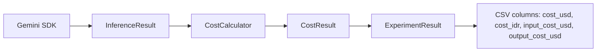

# 📘 Dokumentasi Teknis — AgentBench-SE

> **Penelitian:** Analisis Trade-off Strategi Orkestrasi AI Agent terhadap Efektivitas, Efisiensi, dan Biaya Inferensi dalam Tugas Bug Fixing Perangkat Lunak
> **Peneliti:** Agi Rahman Setiadi — Universitas Negeri Jakarta
> **Status:** Tahap 5 — Cost calculation selesai, siap Final Run (Gemini)
> **Last Updated:** 2026-07-15

---

## Daftar Isi

1. [Overview & Tujuan Penelitian](#1-overview--tujuan-penelitian)
2. [Arsitektur Sistem](#2-arsitektur-sistem)
3. [Struktur Direktori](#3-struktur-direktori)
4. [Komponen Inti](#4-komponen-inti)
   - 4.1 [Models](#41-models)
   - 4.2 [Providers](#42-providers)
   - 4.3 [Strategies](#43-strategies)
   - 4.4 [Experiment Pipeline](#44-experiment-pipeline)
   - 4.5 [Utils & CLI](#45-utils--cli)
5. [Alur Eksekusi](#5-alur-eksekusi)
6. [Tiga Strategi Orkestrasi](#6-tiga-strategi-orkestrasi)
7. [Metrik & Output](#7-metrik--output)
8. [Rate Limiting & Konfigurasi](#8-rate-limiting--konfigurasi)
9. [Cara Menjalankan](#9-cara-menjalankan)
10. [Status & Hasil Testing](#10-status--hasil-testing)
11. [Knowledge Graph (graphify)](#11-knowledge-graph-graphify)
12. [Catatan Pengembangan](#12-catatan-pengembangan)

---

## 1. Overview & Tujuan Penelitian

Penelitian ini mengevaluasi **tiga strategi orkestrasi AI Agent** dalam menyelesaikan tugas *software bug fixing* menggunakan **model AI yang identik** (Gemini 2.0 Flash Lite / Groq Llama-3.3-70B). Tujuannya agar perbedaan hasil **hanya dipengaruhi oleh strategi orkestrasi**, bukan kemampuan model.

### Research Questions

| RQ | Pertanyaan | Metrik Kuantitatif |
|:---|:-----------|:------------------|
| **RQ1** | Perbedaan efektivitas antar strategi? | Execution success, error rate |
| **RQ2** | Perbedaan efisiensi antar strategi? | `execution_time`, `inference_count` |
| **RQ3** | Trade-off efektivitas vs biaya inferensi? | `prompt_tokens`, `completion_tokens`, `total_tokens` |

### Tiga Strategi

| Kode | Strategi | Agent yang Terlibat | Inferensi |
|:----|:---------|:-------------------|:----------|
| **S1** | Direct Execution | Executor saja | 1× |
| **S2** | Planning-based | Planner → Executor | 2× |
| **S3** | Planning + Review | Planner → Executor → Reviewer → (Revisi) | 3–4× |

---

## 2. Arsitektur Sistem

```
┌─────────────────────────────────────────────────────────────┐
│                       SWE-bench Lite                          │
│                   (15-20 issue Django)                        │
└───────────────────────────────┬─────────────────────────────┘
                                  │ select_issues()
                                  ▼
┌─────────────────────────────────────────────────────────────┐
│  main.py  (CLI Entry Point)                                   │
│  ├─ Provider init (Gemini / Groq)  → health_check()          │
│  ├─ Dataset loader             → select_issues()             │
│  └─ run_experiments(issues, strategies, output)             │
└──────────┬───────────────────────────────────┬─────────────┘
           │                                     │
           ▼                                     ▼
┌──────────────────────┐              ┌──────────────────────────┐
│  Strategies           │              │  Experiment Runner       │
│  ├─ DirectStrategy    │              │  (run_experiments)       │
│  ├─ PlanningStrategy  │──calls──▶   │  ├─ loop per issue×strat  │
│  └─ ReviewStrategy    │              │  ├─ rate limiting (1.5s) │
│                       │              │  ├─ extract_diff()       │
│                       │              │  └─ export CSV + JSONL   │
└──────────┬───────────┘              └───────────┬──────────────┘
           │                                       │
           ▼                                       ▼
┌──────────────────────┐              ┌──────────────────────────┐
│  Providers            │              │  results/                │
│  ├─ GeminiProvider    │              │  ├─ csv/experiment_*.csv │
│  └─ GroqProvider      │              │  ├─ predictions/*.jsonl  │
│                       │              │  └─ patches/*.txt        │
└──────────────────────┘              └──────────────────────────┘
```

**Prinsip desain:** Tanpa abstract base class, tanpa controller kompleks, tanpa Docker untuk strategi. Setiap strategi adalah kelas mandiri yang memanggil provider secara *sequential*. Cukup untuk menjawab RQ1–RQ3 tanpa overengineering.

---

## 3. Struktur Direktori

```
D:\development\Skripsi2\AgantBech-SE\
├── sdd.md                       ← Spec-Driven Development (panduan utama)
├── README.md                    ← (kosong, akan diisi)
├── requirements.txt
├── .env                         ← API keys (GEMINI_API_KEY, GROQ_API_KEY)
├── docs/
│   ├── .agent.memory.md         ← Persistence memory lintas sesi
│   └── TECHNICAL.md             ← Dokumentasi ini
├── src/
│   ├── main.py                  ← CLI entry point
│   ├── config.py                ← Load .env (Config class)
│   ├── dataset_loader.py        ← SWE-bench Lite loader
│   ├── view_results.py          ← Viewer hasil eksperimen
│   ├── models/
│   │   ├── issue.py             ← Issue dataclass
│   │   ├── inference.py         ← InferenceResult + InferenceRun (NEW)
│   │   ├── patch.py             ← Patch dataclass
│   │   └── result.py            ← ExperimentResult (refactored, mengandung InferenceRun)
│   ├── providers/
│   │   ├── gemini_provider.py   ← Gemini API wrapper + token tracking
│   │   └── groq_provider.py     ← Groq API wrapper + token tracking
│   ├── strategies/
│   │   ├── direct_strategy.py   ← S1 (1 agent)
│   │   ├── planning_strategy.py ← S2 (2 agent)
│   │   └── review_strategy.py   ← S3 (3-4 agent)
│   ├── prompts/
│   │   ├── direct_prompt.md     ← Prompt S1
│   │   ├── planner.md           ← Prompt Planner (S2, S3)
│   │   ├── executor.md          ← Prompt Executor (S2, S3)
│   │   └── reviewer.md          ← Prompt Reviewer (S3)
│   ├── experiments/
│   │   ├── runner.py            ← Orchestrator eksperimen
│   │   └── swebench_adapter.py  ← extract_diff() parser
│   ├── evaluation/
│   │   └── evaluator.py         ← (kosong, stub)
│   ├── utils/
│   │   ├── logger.py            ← Loguru config
│   │   └── prompt_loader.py     ← Load prompt dari file
│   └── logs/
│       └── agentbench.log       ← Execution logs
├── results/
│   ├── dry_run/                 ← 1 issue × 3 strategi
│   ├── testing_run/             ← 10 issues × 3 strategi (Groq)
│   └── final_run/               ← (akan diisi oleh Final Run, Gemini)
└── graphify-out/                ← Knowledge graph (lihat §11)
```

---

## 4. Komponen Inti

### 4.1 Models

**`src/models/issue.py`** — Representasi satu bug issue dari SWE-bench.
```python
@dataclass
class Issue:
    instance_id: str        # "django__django-10914"
    repo: str               # "django/django"
    base_commit: str        # commit hash
    problem_statement: str  # deskripsi bug
    hints: str = ""

    def to_prompt(self) -> str:
        return f"Instance ID: {self.instance_id}\n\nProblem Statement:\n{self.problem_statement}"
```

**`src/models/patch.py`** — Raw response dari LLM.
```python
@dataclass
class Patch:
    response: str
```

**`src/models/result.py`** — Metrik eksperimen (refactor 2026-07-15 berdasarkan Kritik #1, #4).

```python
@dataclass
class InferenceResult:
    response: str
    usage: dict          # {prompt_tokens, completion_tokens, total_tokens}
    execution_time: float
    finish_reason: str
    model: str

@dataclass
class Patch:
    response: str

@dataclass
class ExperimentResult:
    instance_id: str
    strategy: str
    model: str
    execution_time: float = 0.0
    inference_count: int = 0
    prompt_tokens: int = 0
    completion_tokens: int = 0
    total_tokens: int = 0
    patch_preview: str = ""
    error: str = ""
    timestamp: str = ""
```

> **Catatan:** `InferenceResult` menggantikan `str` sebagai return `generate()`. `last_usage` dihapus — semua metadata dikembalikan langsung (Kritik #2, #3). `ExperimentResult` fokus pada agregasi per-eksperimen, hasil inferensi disimpan dalam `InferenceRun` terpisah (Kritik #4).

---

### 4.2 Providers

Abstraksi API LLM. Keduanya memiliki interface identik: `generate(prompt) -> InferenceResult` (refactor 2026-07-15, Kritik #1-3) dan `health_check() -> bool`.

**`src/providers/gemini_provider.py`**
- Pakai `google.genai` SDK
- Model default: `gemini-2.0-flash-lite`
- `generate()` mengembalikan `InferenceResult(response, usage, execution_time, finish_reason, model)`
- Token tracking via `response.usage_metadata`
- Timeout: 60 detik

**`src/providers/groq_provider.py`**
- Pakai `openai` SDK dengan `base_url="https://api.groq.com/openai/v1"`
- Model default: `llama-3.3-70b-versatile`
- `generate()` mengembalikan `InferenceResult`
- Token tracking via `response.usage`
- Timeout: 60 detik
- **Rate limit:** 30 RPM, 12K tokens/minute

> **Catatan refactor:** Atribut `last_usage` dihapus. Semua metadata inferensi kini dikembalikan sebagai `InferenceResult.usage` (Kritik #3). Ini menghilangkan *hidden state* dan mencegah race condition pada eksekusi berurutan/paralel.

---

### 4.3 Strategies

Setiap strategi mengimplementasikan `run(issue: Issue) -> tuple[Patch, ExperimentResult]`. Artifact intermediate sekarang disimpan ke file untuk dokumentasi penelitian (Kritik #6, #7).

**`src/strategies/direct_strategy.py`** — S1
```
[Issue] ──► [Executor] ──► [Patch]
```
- 1 inference call
- Prompt: `direct_prompt.md`
- Return: `(Patch, ExperimentResult)` dengan `inference_count=1`
- Artifact: `final_patch.txt`

**`src/strategies/planning_strategy.py`** — S2
```
[Issue] ──► [Planner] ──► [Planning Doc] ──► [Executor] ──► [Patch]
```
- 2 inference calls (planner + executor)
- Variable `plan` disimpan ke artifact untuk dokumentasi Bab IV (Kritik #6)
- Artifact: `plan.txt`, `final_patch.txt`

**`src/strategies/review_strategy.py`** — S3
```
[Issue] ──► [Planner] ──► [Planning Doc]
                     ──► [Executor] ──► [Initial Patch]
                              ──► [Reviewer] ──► [Feedback]
                                        ──► [Executor Revisi] ──► [Final Patch]
```
- 3–4 inference calls (planner + executor + reviewer + [revisi jika NEEDS_REVISION])
- Logic revisi: `needs_revision = "APPROVED" not in feedback.upper()[:50]`
- Artifact: `plan.txt`, `initial_patch.txt`, `review_feedback.txt`, `final_patch.txt`

> **Artifact folder:** Setiap issue disimpan ke `results/artifacts/<instance_id>/` berisi file-file intermediate di atas untuk keperluan dokumentasi Bab IV skripsi.

---

### 4.4 Experiment Pipeline

**`src/experiments/runner.py`** — `run_experiments()`
```python
def run_experiments(issues, strategies, output_dir, provider_name, rate_limit_seconds=1.5):
    for issue in issues:
        for name, strategy in strategies.items():
            t0 = time.time()
            patch, result = strategy.run(issue)
            elapsed = time.time() - t0
            result.execution_time = elapsed
            result.model = provider_name          # override model name
            all_results.append(result)

            diff = extract_diff(patch.response)
            all_predictions.append({"instance_id": ..., "model_patch": diff})

            # simpan raw patch (legacy) + artifact per-agent
            Path(f"{output_dir}/patches/{issue.instance_id}_{name}.txt").write_text(
                patch.response, encoding="utf-8"
            )
            _save_artifacts(output_dir, issue.instance_id, result.run, patch.response)

            time.sleep(rate_limit_seconds)        # rate limiting

    # Ekspor CSV (tanpa nested "run") + JSONL predictions
    rows = [{k: v for k, v in asdict(r).items() if k != "run"} for r in all_results]
    df = pd.DataFrame(rows).to_csv(...)
```

**Artifact saving** (`_save_artifacts`): setiap issue disimpan ke
`results/artifacts/<instance_id>/` dengan file:
- `planner.md` — output Planner (S2, S3)
- `executor.md` — output Executor
- `reviewer.md` — output Reviewer (S3)
- `patch.txt` — final patch

Bertujuan untuk dokumentasi Bab IV — membandingkan planning doc vs final patch (Kritik #6, #7).

**`src/experiments/swebench_adapter.py`** — `extract_diff()`
```python
def extract_diff(response: str) -> str:
    # 1. Coba JSON: {"patch": "..."}
    try:
        data = json.loads(response)
        if isinstance(data, dict) and "patch" in data:
            return str(data["patch"]).strip()
    except (json.JSONDecodeError, ValueError):
        pass
    # 2. Fallback markdown code block
    for pattern in [r"```diff\n(.*?)```", r"```patch\n(.*?)```", r"```\n(.*?)```"]:
        match = re.search(pattern, response, re.DOTALL)
        if match:
            return match.group(1).strip()
    # 3. Last resort
    return response.strip()
```

> **Catatan (Kritik #5):** Prompt S1/S2/S3 dipaksa mengeluarkan format JSON terstruktur dengan field `patch`. JSON parser jadi path utama; regex markdown jadi fallback. Mengurangi rapuhnya parsing saat model lupa menutup code block.

---

### 4.5 Utils & CLI

**`src/utils/logger.py`** — Loguru config, log ke `logs/agentbench.log` (rotation 5 MB, level INFO).

**`src/utils/prompt_loader.py`** — `load_prompt(filename)` baca file dari `src/prompts/`.

**`src/config.py`** — `Config` class baca `.env`:
```python
Config.GEMINI_API_KEY, Config.GEMINI_MODEL, Config.GROQ_API_KEY,
Config.GROQ_MODEL, Config.TEMPERATURE (0.2), Config.MAX_RETRIES (3)
```

**`src/main.py`** — CLI:
```bash
python src/main.py --n-issues 15 --provider gemini --output results/final_run
```
- `--repo` (default: django)
- `--n-issues` (default: 15)
- `--output` (default: results)
- `--provider` (choices: gemini, groq; default: groq)

**`src/view_results.py`** — Viewer hasil:
```bash
python src/view_results.py list
python src/view_results.py summary
python src/view_results.py compare
python src/view_results.py errors
python src/view_results.py patch django__django-10914 --strategy review
python src/view_results.py cost_per_success
```

---

## 5. Alur Eksekusi

1. **Init** — `main()` parse args, pilih Provider (Gemini/Groq), jalankan `health_check()`.
2. **Load** — `select_issues(repo_filter, n)` ambil N issue Django dari SWE-bench Lite (deterministik: `filtered[:n]`).
3. **Run** — `run_experiments()` loop: untuk setiap issue × setiap strategi:
   - Panggil `strategy.run(issue)` → `(Patch, ExperimentResult)`
   - Catat `execution_time`, set `model`, simpan patch ke file
   - **Kalkulasi cost** via `CostCalculator` → set `cost_usd`, `cost_idr` ke `ExperimentResult`
   - `time.sleep(1.5)` untuk rate limiting
4. **Export** — CSV (metrik + cost) + JSONL (predictions) + patches (raw text) + artifacts
5. **Summary** — Print mean per strategi ke console

---

## 5.1 Cost Calculation Flow



- **PricingTable** berada di `src/evaluation/cost.py` dengan entry resmi:
  ```python
  PRICING = {
      "gemini-3-flash-preview": {
          "input_per_million": 0.25,
          "output_per_million": 1.50,
          "currency": "USD",
          "pricing_version": "2026-07",
      }
  }
  ```
- **CostCalculator.calculate(inference)** mengembalikan `CostResult` berisi breakdown `input_cost_usd`, `output_cost_usd`, `total_cost_usd`, `total_cost_idr`.
- **ExperimentResult** menambahkan field `cost_usd`, `cost_idr`, `input_cost_usd`, `output_cost_usd` (di‑flatten ke CSV).
- **view_results.py** menampilkan rata‑rata cost per strategi dan cost per successful fix (`cost_per_success`).

> *Catatan*: Untuk development dengan Groq cost dihitung memakai tarif Gemini (fallback) – cukup untuk perbandingan, bukan nilai final.


---

## 6. Tiga Strategi Orkestrasi

| Aspek | S1 (Direct) | S2 (Planning) | S3 (Review) |
|:------|:-----------:|:-------------:|:-----------:|
| Agent | Executor | Planner → Executor | Planner → Executor → Reviewer |
| Inferensi | **1** ⚡ | **2** | **3–4** 🐢 |
| Token | **Rendah** 💰 | Sedang | **Tinggi** 💸 |
| Time | **Cepat** ⏱️ | Sedang | **Lambat** ⏳ |
| Analisis terpisah | ❌ | ✅ | ✅ |
| QA Internal | ❌ | ❌ | ✅ Reviewer |
| Output | Patch saja | Plan + Patch | Plan + Patch + Feedback |

---

## 6. Retry Policy

### Network Error
Ketika provider mengalami network error (timeout, connection error, 500+ status), decorator `@with_retry()` akan melakukan retry dengan exponential backoff.

### Backoff Schedule
| Attempt | Delay (s) |
|:--------|:---------:|
| 1 | 0 (immediate) |
| 2 | 2 |
| 3 | 4 |
| 4 | 8 |

### Configuration
- `Config.MAX_RETRIES=3` (default) — jumlah maximum retry
- `base_delay=2.0` — delay awal untuk backoff
- Final attempt: raise exception → `ExperimentResult.evaluation.error` diisi

### Implementation
- File: `src/evaluation/retry.py` — decorator `@with_retry()`
- Digunakan oleh: `GeminiProvider.generate()`, `GroqProvider.generate()`
- Pattern: Network Error → Backoff → Retry → (jika gagal semua) → Exception

### Future Enhancement
- Retry policy bisa dipisah ke module `src/evaluation/retry.py` (sudah terimplementasi)
- Metric retry count di CSV (sudah ada di `inference_count`)

---

## 7. Metrik & Output

### CSV Columns (`experiment_results.csv`)
```
instance_id, strategy, model, execution_time, inference_count,
prompt_tokens, completion_tokens, total_tokens, patch_preview, error, timestamp
```

### predictions.jsonl
```json
{"instance_id": "django__django-10914", "model_patch": "diff --git a/..."}
```
> Digunakan untuk SWE-bench evaluation (saat ini di-skip karena keterbatasan RAM).

### patches/*.txt
Raw LLM response per `issue_strategy.txt`.

---

## 8. Rate Limiting & Konfigurasi

| Provider | RPM | Token/min | Implementasi |
|:---------|:----:|:---------:|:-------------|
| Gemini | 1500 | tinggi | Tidak perlu delay |
| Groq | 30 | 12,000 | `time.sleep(1.5)` antar strategi |

**Konfigurasi `.env`:**
```
GEMINI_API_KEY=xxx
GROQ_API_KEY=xxx
GEMINI_MODEL=gemini-2.0-flash-lite
GROQ_MODEL=llama-3.3-70b-versatile
TEMPERATURE=0.2
MAX_RETRIES=3
```

---

## 9. Cara Menjalankan

### Setup
```bash
pip install -r requirements.txt
pip install swebench datasets pandas loguru python-dotenv
```

### Dry Run (1 issue)
```bash
python src/main.py --n-issues 1 --provider groq --output results/dry_run
```

### Testing Run (10 issues, Groq)
```bash
python src/main.py --n-issues 10 --provider groq --output results/testing_run
```

### Final Run (15 issues, Gemini) ⏳
```bash
python src/main.py --n-issues 15 --provider gemini --output results/final_run
```

### Analisis
```bash
python src/view_results.py --file results/final_run/csv/experiment_results.csv summary
```

---

## 10. Status & Hasil Testing

**Testing Run (Groq, 10 issues Django)** — 2026-07-14:
- ✅ **28/30 runs sukses** (93%)
- ❌ 2 connection errors (transient, bukan rate limit)
- ⏱️ Total ~7 menit

| Strategi | Avg Time | Avg Tokens | Avg Inferences | Success |
|:---------|:--------:|:----------:|:--------------:|:-------:|
| Direct | 1.99s | 881.4 | 1.0 | 10/10 ✅ |
| Planning | 7.25s | 1,720.1 | 1.8 | 9/10 ⚠️ |
| Review | 16.37s | 3,722.7 | 3.6 | 8/10 ⚠️ |

**Pending:**
- Final Run (Gemini, 15 issues) — est. 60-90 menit
- Analisis RQ1-RQ3
- SWE-bench eval — **SKIPPED** (RAM 8GB tidak cukup untuk Docker)

---

## 11. Knowledge Graph (graphify)

Proyek menggunakan **graphify** untuk memetakan arsitektur kode menjadi knowledge graph.

**Cara regenerate:**
```bash
python -m graphify . --code-only     # AST extraction (no LLM key needed)
python -m graphify cluster-only .    # generate report + label communities
```

**Hasil terbaru (2026-07-14):**
- 62 nodes, 116 edges, 16 communities
- Extraction: 80% EXTRACTED · 20% INFERRED
- God nodes: `Issue` (10 edges), `main()` (9), `ExperimentResult` (8)
- Community hubs: Strategy Implementations, Module Definitions, Results Viewer CLI, Gemini Provider, Experiment Runner, Groq Provider

**Output:** `graphify-out/graph.json`, `graphify-out/graph.html`, `graphify-out/GRAPH_REPORT.md`

---

## 12. Catatan Pengembangan

### Design Decisions
| Tanggal | Keputusan | Alasan |
|:-------|:---------|:-------|
| 2026-07-13 | Simple classes tanpa abstract base | Hindari overengineering |
| 2026-07-13 | Gemini primary, Groq fallback | Gemini untuk eksperimen, Groq untuk dev |
| 2026-07-13 | SWE-bench Lite (Django, 15 issues) | Academic standard |
| 2026-07-13 | `ExperimentResult` sebagai 1 result model | Simplifikasi |
| 2026-07-14 | CSV: `model` after `strategy`, `timestamp` di akhir | Tracking & readability |
| 2026-07-14 | Rate limiting 1.5s antara strategi | Respect Groq 30 RPM |
| 2026-07-14 | Skip SWE-bench eval | Low RAM (8GB) |

### Future Enhancements (Belum Diimplementasi)
| Prioritas | Enhancement |
|:----------|:------------|
| P1 | Simpan artifact per agent (planning doc, review feedback) |
| P1 | `view_results.py diff` — baca full patch |
| P2 | `view_results.py side-by-side` — tabel komparasi |
| P2 | Visualisasi (bar chart, box plot) |
| P3 | Analisis lengkap + penulisan skripsi |

### Known Issues
1. **Artifact hilang** — Planning doc & review feedback tidak disimpan ke file (hanya final patch).
2. **Patch format inconsistency** — Direct pakai ````diff`, Planning/Review kadang `diff --git`.
3. **Connection errors** — Transient network failures (2/30 di testing), butuh retry mechanism.
4. **`evaluator.py` kosong** — Belum diimplementasi (SWE-bench eval di-skip).

---

**Dokumentasi ini mencakup seluruh pipeline dari data loading hingga analisis output.**
