# PART 2

# Experiment Architecture & Component Specification

---

# 12. Architecture Overview

## 12.1 Purpose

Bab ini mendefinisikan arsitektur eksperimen yang digunakan untuk mengevaluasi berbagai strategi orkestrasi AI Agent pada tugas *software bug fixing*. Arsitektur dirancang sebelum tahap implementasi (*design freeze*) sehingga seluruh eksperimen dilakukan berdasarkan spesifikasi yang sama.

Dokumen ini menjadi acuan implementasi seluruh komponen penelitian, mulai dari pengendalian eksperimen, eksekusi strategi, evaluasi hasil, hingga pengumpulan metrik penelitian.

---

## 12.2 Objective

Architecture Overview memiliki beberapa tujuan utama sebagai berikut.

- Menjelaskan struktur umum sistem eksperimen.
- Menjelaskan hubungan antar komponen penelitian.
- Menjamin seluruh strategi memperoleh perlakuan eksperimen yang identik.
- Menjadi dasar implementasi seluruh komponen pada tahap berikutnya.
- Menjamin eksperimen dapat direproduksi (*reproducible*).

---

## 12.3 Design Philosophy

Arsitektur penelitian mengadopsi pendekatan **Experiment-Centric Architecture**.

Pada pendekatan ini, eksperimen menjadi pusat dari keseluruhan sistem. Strategi orkestrasi diperlakukan sebagai modul independen yang dapat diganti tanpa mengubah mekanisme eksperimen.

Dengan pendekatan tersebut, penelitian mampu memisahkan:

- logika eksperimen,
- logika strategi,
- logika evaluasi,
- logika analisis hasil.

Pemisahan ini meningkatkan modularitas sistem sekaligus memastikan bahwa perbedaan hasil eksperimen hanya berasal dari strategi yang diuji.

---

## 12.4 Design Principles

Arsitektur eksperimen dibangun berdasarkan lima prinsip utama.

### Principle 1 — Fair Comparison

Seluruh strategi harus dijalankan menggunakan kondisi eksperimen yang identik.

Komponen yang dikontrol meliputi:

- Model AI
- Dataset
- Repository
- Prompt dasar
- Parameter inferensi
- Evaluation Engine
- Lingkungan eksekusi

Dengan demikian, satu-satunya variabel yang berubah adalah strategi orkestrasi AI Agent.

---

### Principle 2 — Component Independence

Setiap komponen hanya mengetahui antarmuka (*interface*) dari komponen lain.

Sebagai contoh:

- Experiment Controller tidak mengetahui implementasi Planner maupun Reviewer.
- Evaluation Engine tidak mengetahui bagaimana patch dihasilkan.
- Metrics Collector tidak mengetahui strategi yang digunakan.

Prinsip ini mengurangi ketergantungan antar komponen (*low coupling*).

---

### Principle 3 — Deterministic Evaluation

Seluruh proses evaluasi dilakukan menggunakan mekanisme deterministik.

Evaluation Engine tidak menggunakan Large Language Model maupun AI untuk menentukan hasil evaluasi.

Evaluasi dilakukan melalui:

- Build Project
- Unit Testing
- Patch Validation
- Runtime Measurement
- Token Measurement

---

### Principle 4 — Reproducibility

Eksperimen harus dapat dijalankan kembali menggunakan konfigurasi yang sama.

Seluruh parameter eksperimen dicatat sehingga penelitian dapat direplikasi oleh peneliti lain.

---

### Principle 5 — Separation of Responsibility

Setiap komponen hanya memiliki satu tanggung jawab utama (*Single Responsibility Principle*).

Sebagai contoh:

- Planner hanya melakukan analisis.
- Executor hanya menghasilkan patch.
- Reviewer hanya mengevaluasi patch.
- Evaluation Engine hanya melakukan evaluasi objektif.
- Metrics Collector hanya mengumpulkan metrik.

---

# 13. Overall Experiment Architecture

## 13.1 Architecture Overview

Gambar berikut menunjukkan arsitektur eksperimen secara keseluruhan.

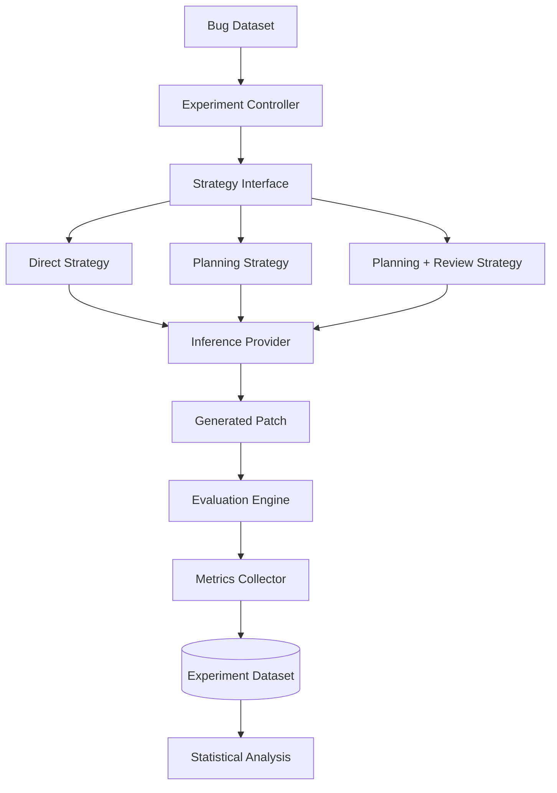

Diagram tersebut menunjukkan bahwa seluruh strategi memiliki alur evaluasi yang identik. Perbedaan hanya terjadi pada workflow internal masing-masing strategi.

---

## 13.2 Main Components

Arsitektur penelitian terdiri atas enam komponen utama.

| Component | Responsibility |
|------------|----------------|
| Experiment Controller | Mengelola seluruh proses eksperimen. |
| Strategy Interface | Menyediakan antarmuka standar bagi seluruh strategi. |
| Strategy Implementation | Mengimplementasikan workflow masing-masing strategi orkestrasi. |
| Evaluation Engine | Mengevaluasi patch secara objektif dan deterministik. |
| Metrics Collector | Mengumpulkan seluruh metrik eksperimen. |
| Experiment Dataset | Menyimpan hasil eksperimen yang akan dianalisis. |

---

## 13.3 Architecture Flow

Secara umum, alur eksperimen terdiri atas langkah-langkah berikut.

1. Experiment Controller memilih sebuah issue dari benchmark.
2. Controller memilih strategi yang akan dijalankan.
3. Strategy Interface meneruskan issue ke implementasi strategi yang sesuai.
4. Strategi menghasilkan patch menggunakan Inference Provider.
5. Patch dievaluasi oleh Evaluation Engine.
6. Evaluation Engine menghasilkan hasil evaluasi.
7. Metrics Collector mengumpulkan seluruh metrik eksperimen.
8. Hasil eksperimen disimpan ke Experiment Dataset.
9. Dataset digunakan pada tahap analisis statistik.

---

## 13.4 Design Rationale

Arsitektur ini dipilih karena memiliki beberapa keunggulan.

- Modular sehingga setiap strategi dapat dikembangkan secara independen.
- Extensible sehingga strategi baru dapat ditambahkan tanpa mengubah Controller.
- Reproducible karena seluruh konfigurasi eksperimen dikontrol.
- Fair karena semua strategi memperoleh perlakuan yang sama.
- Maintainable karena setiap komponen memiliki tanggung jawab yang jelas.

Dengan pendekatan ini, penelitian tidak hanya menghasilkan implementasi AI Agent, tetapi juga menyediakan sebuah *experimental framework* yang dapat digunakan kembali pada penelitian lanjutan.

---

---

# 14. Strategy Framework

## 14.1 Purpose

Strategy Framework mendefinisikan bagaimana setiap strategi orkestrasi diimplementasikan dalam Experimental Framework.

Setiap strategi diperlakukan sebagai sebuah modul independen yang memiliki alur kerja (*workflow*) tersendiri, namun tetap menggunakan antarmuka (*Strategy Interface*) yang sama. Pendekatan ini memungkinkan seluruh strategi dibandingkan secara adil tanpa mengubah mekanisme eksperimen.

Dengan demikian, fokus penelitian berada pada evaluasi strategi, bukan pada implementasi teknis masing-masing komponen.

---

## 14.2 Strategy Interface

Seluruh strategi harus mengimplementasikan antarmuka yang sama.

```text
Input:
- Bug Issue
- Repository
- Experiment Configuration

Output:
- Generated Patch
- Execution Metadata
```

Dengan antarmuka yang seragam, Experiment Controller dapat menjalankan strategi apa pun tanpa mengetahui implementasi internalnya.

Prinsip ini menerapkan konsep **Dependency Inversion Principle (DIP)**, di mana komponen tingkat tinggi bergantung pada abstraksi, bukan implementasi konkret.

---

## 14.3 Strategy Comparison

Penelitian membandingkan tiga strategi orkestrasi AI Agent.

| Strategy | Planner | Executor | Reviewer |
|-----------|----------|-----------|-----------|
| Direct Execution | ❌ | ✅ | ❌ |
| Planning-based | ✅ | ✅ | ❌ |
| Planning + Review | ✅ | ✅ | ✅ |

Ketiga strategi menggunakan:

- Model AI yang sama
- Prompt dasar yang setara
- Dataset yang sama
- Repository yang sama
- Evaluation Engine yang sama
- Parameter inferensi yang sama

Dengan demikian, satu-satunya faktor yang berubah adalah mekanisme orkestrasi.

---

## 14.4 Strategy Workflow

### Strategy 1 — Direct Execution

Strategi ini merupakan pendekatan paling sederhana.

Issue dikirim langsung kepada Executor untuk menghasilkan patch tanpa proses analisis maupun peninjauan.

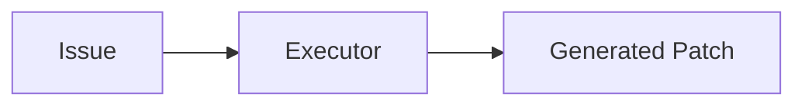

Karakteristik:

- Workflow paling sederhana.
- Jumlah inferensi minimum.
- Latensi paling rendah.
- Tidak memiliki tahap validasi internal.

---

### Strategy 2 — Planning-based

Strategi ini menambahkan tahap analisis sebelum implementasi.

Planner bertugas memahami issue dan menghasilkan Planning Document yang digunakan Executor sebagai panduan implementasi.

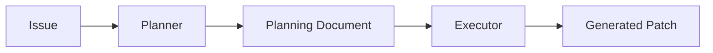

Karakteristik:

- Memiliki proses analisis awal.
- Executor bekerja berdasarkan rencana terstruktur.
- Biaya inferensi lebih tinggi dibanding Direct Execution.
- Potensi kualitas patch lebih baik.

---

### Strategy 3 — Planning + Review

Strategi ini menambahkan proses evaluasi internal sebelum patch dikirim ke Evaluation Engine.

Reviewer melakukan pemeriksaan terhadap patch awal dan memberikan umpan balik terstruktur kepada Executor.

Executor kemudian melakukan revisi apabila diperlukan.

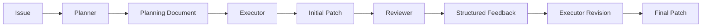

Karakteristik:

- Workflow paling lengkap.
- Memiliki mekanisme quality assurance internal.
- Jumlah inferensi paling tinggi.
- Berpotensi menghasilkan patch dengan kualitas terbaik.

---

## 14.5 Strategy Design Rationale

Ketiga strategi dipilih untuk merepresentasikan peningkatan kompleksitas orkestrasi secara bertahap.

Level 1:

Direct Execution

↓

Level 2:

Planning-based

↓

Level 3:

Planning + Review

Pendekatan bertingkat ini memungkinkan penelitian mengevaluasi bagaimana penambahan peran (*role*) memengaruhi efektivitas, efisiensi, dan biaya inferensi.

Selain itu, strategi tersebut juga banyak ditemukan pada penelitian AI Software Engineering terkini sehingga hasil penelitian memiliki relevansi terhadap perkembangan state-of-the-art.

---

# 15. Framework Design Principles

Framework eksperimen dirancang berdasarkan prinsip-prinsip rekayasa perangkat lunak untuk memastikan validitas penelitian dan kemudahan pengembangan.

## 15.1 Principle 1 — Fair Comparison

Seluruh strategi dijalankan pada kondisi eksperimen yang identik.

Perbedaan hasil eksperimen hanya boleh berasal dari strategi orkestrasi yang digunakan.

---

## 15.2 Principle 2 — Low Coupling

Komponen tidak saling bergantung secara langsung.

Experiment Controller hanya berinteraksi melalui Strategy Interface.

Evaluation Engine tidak mengetahui bagaimana patch dihasilkan.

Metrics Collector tidak mengetahui strategi yang digunakan.

---

## 15.3 Principle 3 — High Cohesion

Setiap komponen memiliki satu tanggung jawab utama.

Prinsip ini meningkatkan keterbacaan kode, mempermudah pemeliharaan sistem, serta mengurangi kompleksitas implementasi.

---

## 15.4 Principle 4 — Reproducibility

Seluruh konfigurasi eksperimen disimpan dan dapat digunakan kembali sehingga eksperimen dapat direplikasi oleh peneliti lain.

---

## 15.5 Principle 5 — Extensibility

Framework memungkinkan penambahan strategi baru tanpa mengubah komponen inti.

Sebagai contoh, apabila pada penelitian berikutnya ingin ditambahkan:

- Reflection Strategy
- Graph-based Strategy
- Hierarchical Strategy
- Planner–Executor–Reviewer–Tester

maka implementasi cukup menambahkan modul strategi baru yang memenuhi Strategy Interface.

Experiment Controller, Evaluation Engine, dan Metrics Collector tidak perlu dimodifikasi.

---

## 15.6 Design Summary

Framework penelitian dirancang untuk memenuhi tiga tujuan utama.

1. Menjamin keadilan eksperimen (*fair comparison*).
2. Menjamin eksperimen dapat direproduksi (*reproducibility*).
3. Memungkinkan pengembangan strategi baru (*extensibility*).

Dengan pendekatan tersebut, framework tidak hanya mendukung kebutuhan penelitian ini, tetapi juga dapat digunakan sebagai dasar bagi penelitian lanjutan mengenai evaluasi strategi orkestrasi AI Agent.

---

---

# 16. Component Specification

Bab ini mendefinisikan spesifikasi teknis setiap komponen yang terlibat pada Strategy Framework.

Setiap komponen dirancang menggunakan prinsip **Single Responsibility Principle (SRP)** sehingga hanya memiliki satu tanggung jawab utama.

Spesifikasi pada bab ini bersifat **implementation-independent**, artinya tidak bergantung pada framework maupun bahasa pemrograman tertentu.

---

# 16.1 Planner

## Purpose

Planner bertanggung jawab melakukan analisis awal terhadap bug issue sebelum proses implementasi dilakukan.

Planner tidak menghasilkan perubahan kode, melainkan menghasilkan dokumen analisis yang akan digunakan sebagai panduan oleh Executor.

---

## Role

Planner berperan sebagai **Analysis Role** dalam workflow orkestrasi.

Seluruh keputusan implementasi berasal dari hasil analisis Planner.

---

## Responsibilities

Planner memiliki tanggung jawab sebagai berikut.

- Memahami deskripsi bug.
- Mengidentifikasi dugaan penyebab (*root cause*).
- Mengidentifikasi file atau modul yang kemungkinan terdampak.
- Menentukan strategi perbaikan.
- Mengumpulkan bukti (*evidence*) yang mendukung analisis.
- Menentukan tingkat keyakinan (*confidence level*).

Planner tidak diperbolehkan menghasilkan patch maupun melakukan modifikasi kode.

---

## Inputs

Planner menerima informasi berikut.

| Input | Description |
|--------|-------------|
| Bug Issue | Deskripsi bug yang akan diselesaikan. |
| Repository Context | Struktur repository dan file yang relevan. |
| Experiment Configuration | Konfigurasi eksperimen yang digunakan. |

---

## Outputs

Planner menghasilkan sebuah **Planning Document**.

Planning Document memiliki struktur sebagai berikut.

| Field | Description |
|--------|-------------|
| Bug Summary | Ringkasan bug. |
| Root Cause Hypothesis | Dugaan penyebab bug. |
| Affected Files | Daftar file yang kemungkinan terdampak. |
| Repair Strategy | Strategi perbaikan yang disarankan. |
| Evidence | Bukti yang mendukung analisis. |
| Confidence | Tingkat keyakinan (Low, Medium, High). |

Planning Document menjadi satu-satunya artefak yang dikirimkan kepada Executor.

---

## Internal Workflow

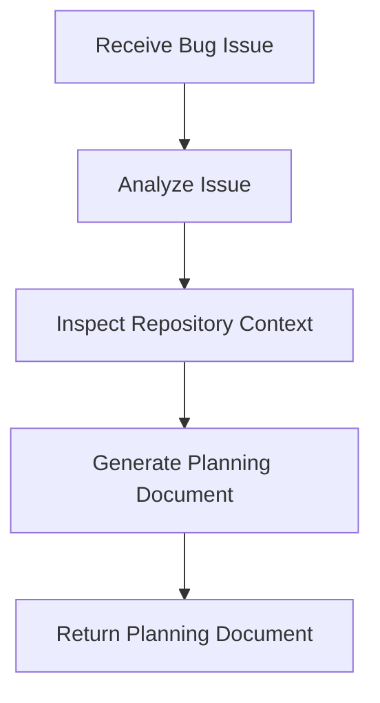

---

## Decision Rules

Planner mengikuti aturan berikut.

- Tidak membuat perubahan kode.
- Tidak melakukan build.
- Tidak menjalankan unit test.
- Tidak mengevaluasi patch.
- Hanya menghasilkan Planning Document.

---

## Constraints

Planner harus memenuhi beberapa batasan.

- Tidak boleh mengubah repository.
- Tidak boleh menghasilkan patch.
- Tidak boleh berkomunikasi langsung dengan Evaluation Engine.
- Harus menghasilkan output menggunakan format yang telah ditentukan.

---

## Failure Handling

Planner dianggap gagal apabila.

- gagal memahami issue,
- menghasilkan Planning Document yang tidak lengkap,
- tidak mengidentifikasi file yang terdampak,
- menghasilkan output yang tidak sesuai format.

Apabila Planner gagal, eksperimen dihentikan dan status dicatat sebagai **Planning Failure**.

---

## Interaction

Planner hanya berinteraksi dengan.

- Experiment Controller
- Executor

Planner tidak berinteraksi langsung dengan Reviewer maupun Evaluation Engine.

---

## Design Rationale

Planner dipisahkan dari Executor untuk memastikan proses analisis dilakukan sebelum implementasi.

Pemisahan ini memungkinkan penelitian mengevaluasi apakah tahap analisis memberikan peningkatan terhadap efektivitas penyelesaian bug.

---

# 16.2 Executor

## Purpose

Executor bertanggung jawab menghasilkan patch perangkat lunak berdasarkan informasi yang diterima.

Executor merupakan satu-satunya komponen yang diperbolehkan melakukan perubahan kode.

---

## Role

Executor berperan sebagai **Implementation Role**.

---

## Responsibilities

Executor memiliki tanggung jawab sebagai berikut.

- Memahami issue atau Planning Document.
- Menghasilkan patch perangkat lunak.
- Melakukan revisi patch berdasarkan Structured Feedback (apabila tersedia).
- Menghasilkan patch final.

Executor tidak melakukan evaluasi terhadap patch yang dihasilkan.

---

## Inputs

Executor menerima salah satu dari dua jenis input berikut.

### Direct Strategy

| Input | Description |
|--------|-------------|
| Bug Issue | Issue langsung dari Experiment Controller. |

### Planning Strategy

| Input | Description |
|--------|-------------|
| Planning Document | Dokumen hasil analisis Planner. |

### Planning + Review Strategy

Selain Planning Document, Executor juga dapat menerima Structured Feedback dari Reviewer sebagai dasar revisi patch.

---

## Outputs

Executor menghasilkan.

| Output | Description |
|---------|-------------|
| Initial Patch | Patch pertama yang dihasilkan. |
| Final Patch | Patch akhir setelah revisi (jika ada). |
| Execution Metadata | Informasi proses inferensi. |

---

## Internal Workflow

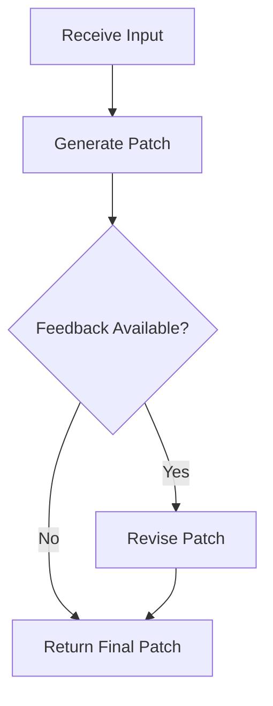

---

## Decision Rules

Executor mengikuti aturan berikut.

- Seluruh perubahan harus berada dalam ruang lingkup issue.
- Tidak boleh membuat perubahan yang tidak relevan.
- Tidak melakukan evaluasi terhadap patch.
- Tidak menjalankan unit test.

---

## Constraints

Executor harus memenuhi beberapa batasan.

- Tidak boleh mengubah issue.
- Tidak boleh mengubah konfigurasi eksperimen.
- Tidak boleh mengakses Metrics Collector.
- Tidak boleh mengakses Evaluation Engine.

---

## Failure Handling

Executor dianggap gagal apabila.

- tidak menghasilkan patch,
- menghasilkan patch yang kosong,
- menghasilkan format patch yang tidak valid,
- proses inferensi gagal.

Status eksperimen dicatat sebagai **Execution Failure**.

---

## Interaction

Executor dapat berinteraksi dengan.

- Experiment Controller
- Planner
- Reviewer

Executor tidak berinteraksi langsung dengan Evaluation Engine.

---

## Design Rationale

Executor dipisahkan dari Planner agar proses analisis dan implementasi dapat dievaluasi secara independen.

Selain itu, pemisahan ini memungkinkan strategi Direct Execution dan Planning-based menggunakan komponen Executor yang sama sehingga hanya mekanisme orkestrasi yang berubah selama eksperimen.

---

---

# 16.3 Reviewer

## Purpose

Reviewer bertanggung jawab melakukan evaluasi internal terhadap patch yang dihasilkan Executor sebelum patch dikirim ke Evaluation Engine.

Reviewer merupakan mekanisme *quality assurance* di dalam strategi orkestrasi, bukan evaluator hasil penelitian.

---

## Role

Reviewer berperan sebagai **Quality Assurance Role**.

Reviewer tidak menghasilkan patch baru, melainkan memberikan umpan balik terstruktur (*Structured Feedback*) yang dapat digunakan Executor untuk melakukan revisi.

---

## Responsibilities

Reviewer memiliki tanggung jawab sebagai berikut.

- Mengevaluasi kesesuaian patch terhadap bug issue.
- Memeriksa konsistensi patch dengan Planning Document.
- Mengidentifikasi potensi kesalahan implementasi.
- Memberikan rekomendasi perbaikan.
- Menentukan prioritas perbaikan.
- Menentukan tingkat keyakinan hasil review.

Reviewer tidak melakukan build project maupun unit testing.

---

## Inputs

| Input | Description |
|--------|-------------|
| Planning Artifact | Dokumen hasil Planner. |
| Patch Artifact | Patch awal dari Executor. |
| Bug Issue | Issue yang sedang dikerjakan. |

---

## Outputs

Reviewer menghasilkan **Review Artifact**.

| Field | Description |
|--------|-------------|
| Issue Coverage | Tingkat kesesuaian patch dengan issue. |
| Planning Compliance | Kesesuaian terhadap Planning Artifact. |
| Improvement Suggestion | Rekomendasi revisi. |
| Evidence | Bukti yang mendukung review. |
| Priority | High / Medium / Low. |
| Confidence | High / Medium / Low. |

---

## Internal Workflow

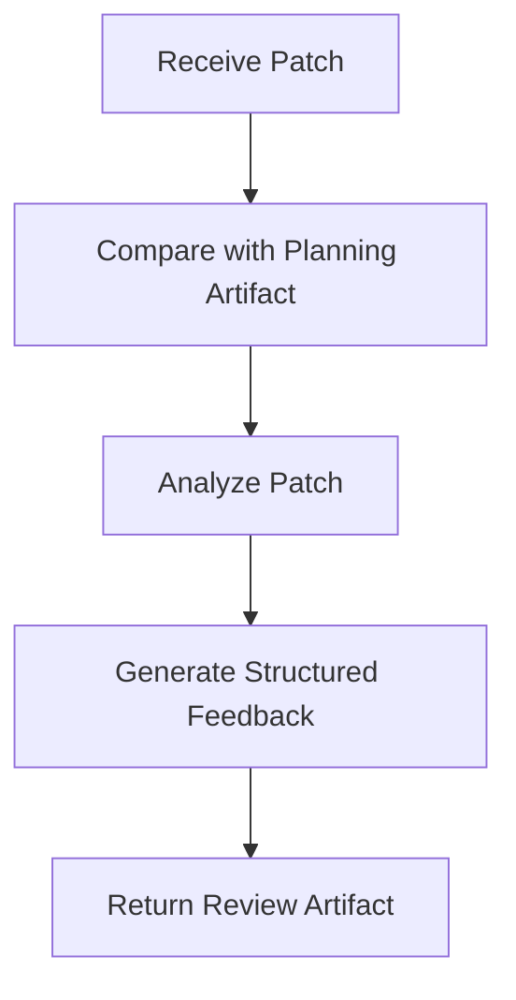

---

## Decision Rules

Reviewer hanya memberikan rekomendasi.

Reviewer tidak boleh:

- mengubah patch,
- membuat patch baru,
- menjalankan evaluasi eksperimen.

---

## Constraints

- Tidak melakukan build.
- Tidak menjalankan unit test.
- Tidak menentukan keberhasilan eksperimen.
- Tidak mengubah repository.

---

## Failure Handling

Reviewer dianggap gagal apabila gagal menghasilkan Review Artifact yang valid.

Status eksperimen tetap dapat dilanjutkan menggunakan patch awal, namun dicatat sebagai **Review Failure**.

---

## Design Rationale

Reviewer diposisikan sebagai mekanisme *quality assurance* internal agar penelitian dapat mengevaluasi apakah proses review meningkatkan kualitas patch dibandingkan strategi tanpa review.

---

# 16.4 Evaluation Engine

## Purpose

Evaluation Engine bertanggung jawab melakukan evaluasi objektif terhadap patch yang dihasilkan strategi.

Evaluation Engine merupakan satu-satunya komponen yang menentukan hasil eksperimen.

---

## Role

Evaluation Engine berperan sebagai **Objective Evaluation Component**.

---

## Responsibilities

- Menerapkan patch ke repository.
- Melakukan proses build.
- Menjalankan unit test.
- Mengukur waktu eksekusi.
- Mengumpulkan penggunaan token.
- Menghasilkan Evaluation Artifact.

---

## Inputs

| Input | Description |
|--------|-------------|
| Patch Artifact | Patch final dari strategi. |
| Repository | Repository target. |
| Evaluation Configuration | Konfigurasi evaluasi. |

---

## Outputs

Evaluation Artifact terdiri atas:

| Metric | Description |
|--------|-------------|
| Build Status | Success / Failed |
| Test Pass Rate | Persentase test berhasil |
| Execution Time | Total waktu eksekusi |
| Prompt Tokens | Token input |
| Completion Tokens | Token output |
| Total Tokens | Total penggunaan token |
| Evaluation Status | Success / Failure |

---

## Internal Workflow

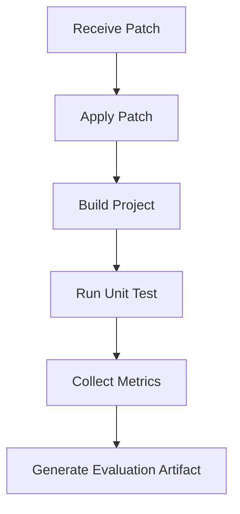

---

## Decision Rules

Evaluation Engine menggunakan evaluasi deterministik.

Tidak diperbolehkan menggunakan AI untuk menentukan hasil evaluasi.

---

## Constraints

- Tidak mengubah strategi.
- Tidak melakukan inferensi AI.
- Tidak melakukan revisi patch.

---

## Design Rationale

Seluruh strategi dievaluasi menggunakan mekanisme yang identik sehingga hasil penelitian bersifat objektif.

---

# 16.5 Experiment Controller

## Purpose

Experiment Controller merupakan komponen utama yang mengendalikan seluruh siklus eksperimen.

---

## Role

Experiment Controller berperan sebagai **Orchestrator**.

---

## Responsibilities

- Memilih issue.
- Memilih strategi.
- Menjalankan eksperimen.
- Mengatur urutan proses.
- Menangani kegagalan eksperimen.
- Menyimpan status eksperimen.

---

## Inputs

- Experiment Configuration
- Dataset
- Strategy Selection

---

## Outputs

- Experiment Record
- Experiment Status

---

## Internal Workflow

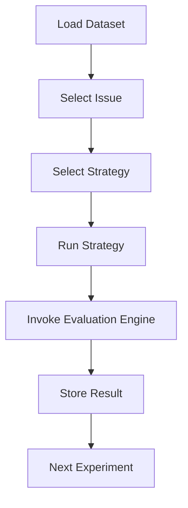

---

## Decision Rules

Controller tidak mengetahui implementasi internal strategi.

Seluruh komunikasi dilakukan melalui Strategy Interface.

---

## Constraints

- Tidak menghasilkan patch.
- Tidak melakukan evaluasi.
- Tidak mengakses LLM secara langsung.

---

## Failure Handling

Jika salah satu eksperimen gagal, Controller mencatat status kegagalan dan melanjutkan eksperimen berikutnya.

---

## Design Rationale

Controller dipisahkan dari seluruh strategi agar penelitian mudah diperluas dan tetap memenuhi prinsip *low coupling*.

---

# 16.6 Metrics Collector

## Purpose

Metrics Collector bertanggung jawab mengumpulkan seluruh hasil eksperimen menjadi dataset penelitian.

---

## Role

Metrics Collector berperan sebagai **Research Data Aggregator**.

---

## Responsibilities

- Mengumpulkan Evaluation Artifact.
- Menghasilkan dataset penelitian.
- Menghitung statistik deskriptif.
- Mengekspor hasil ke format CSV.

---

## Inputs

| Input | Description |
|--------|-------------|
| Evaluation Artifact | Hasil evaluasi eksperimen. |

---

## Outputs

| Output | Description |
|---------|-------------|
| Experiment Dataset | Dataset seluruh eksperimen. |
| Summary Statistics | Statistik deskriptif. |

---

## Internal Workflow

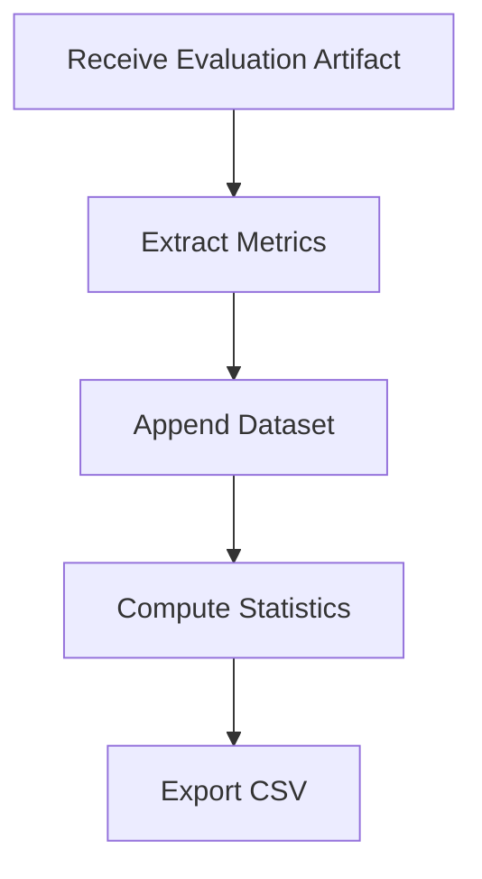

---

## Decision Rules

Metrics Collector hanya melakukan agregasi data.

Tidak diperbolehkan mengubah hasil evaluasi.

---

## Constraints

- Tidak mengakses AI.
- Tidak mengubah Evaluation Artifact.
- Tidak menjalankan eksperimen.

---

## Design Rationale

Pemisahan Metrics Collector memungkinkan analisis statistik dilakukan secara independen tanpa memengaruhi proses eksperimen.

---

---

# 17. Component Interaction

## 17.1 Purpose

Bagian ini menjelaskan bagaimana setiap komponen dalam Experimental Framework saling berinteraksi untuk membentuk satu siklus eksperimen yang utuh.

Berbeda dengan spesifikasi komponen pada bagian sebelumnya, pembahasan pada bagian ini berfokus pada hubungan antar komponen, bukan pada implementasi internal masing-masing komponen.

---

## 17.2 Component Interaction Diagram

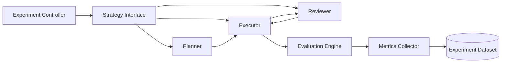

---

## 17.3 Interaction Description

Interaksi antar komponen berlangsung sebagai berikut.

1. Experiment Controller memilih issue dan strategi yang akan dijalankan.
2. Strategy Interface mengarahkan eksekusi ke strategi yang sesuai.
3. Planner (jika digunakan) menghasilkan Planning Artifact.
4. Executor menghasilkan Patch Artifact.
5. Reviewer (jika digunakan) mengevaluasi Patch Artifact dan menghasilkan Review Artifact.
6. Executor melakukan revisi apabila menerima Review Artifact.
7. Patch final dikirim ke Evaluation Engine.
8. Evaluation Engine menghasilkan Evaluation Artifact.
9. Metrics Collector mengubah Evaluation Artifact menjadi dataset penelitian.

Dengan pendekatan ini, setiap komponen memiliki tanggung jawab yang jelas dan tidak saling bergantung secara langsung.

---

# 18. Data Flow

## 18.1 Purpose

Data Flow mendefinisikan bagaimana artefak penelitian berubah selama proses eksperimen.

Pendekatan ini memastikan setiap transformasi data dapat ditelusuri (*traceable*) dan direproduksi.

---

## 18.2 Artifact Flow

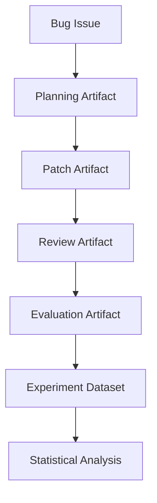

---

## 18.3 Artifact Description

| Artifact | Producer | Consumer |
|-----------|----------|----------|
| Bug Issue | Benchmark Dataset | Planner / Executor |
| Planning Artifact | Planner | Executor |
| Patch Artifact | Executor | Reviewer / Evaluation Engine |
| Review Artifact | Reviewer | Executor |
| Evaluation Artifact | Evaluation Engine | Metrics Collector |
| Experiment Dataset | Metrics Collector | Statistical Analysis |

Seluruh artefak memiliki format yang terstruktur sehingga dapat diproses secara otomatis oleh framework.

---

# 19. Reproducibility

## 19.1 Objective

Penelitian dirancang agar seluruh eksperimen dapat direplikasi oleh peneliti lain menggunakan konfigurasi yang sama.

---

## 19.2 Reproducibility Requirements

Agar hasil eksperimen konsisten, komponen berikut harus dipertahankan.

| Component | Requirement |
|-----------|-------------|
| Benchmark Dataset | Sama |
| Repository Version | Sama |
| AI Model | Sama |
| Prompt Template | Sama |
| Temperature | Sama |
| Max Tokens | Sama |
| Docker Environment | Sama |
| Evaluation Engine | Sama |

Perubahan pada salah satu komponen tersebut harus dicatat sebagai perubahan konfigurasi eksperimen.

---

## 19.3 Experiment Logging

Setiap eksperimen menghasilkan satu Experiment Record yang berisi informasi berikut.

| Field | Description |
|--------|-------------|
| Experiment ID | Identitas eksperimen |
| Strategy | Strategi yang digunakan |
| Issue ID | Identitas bug |
| Repository | Repository target |
| Model | Model AI |
| Execution Time | Lama eksekusi |
| Build Status | Status build |
| Test Pass Rate | Persentase unit test |
| Prompt Tokens | Token input |
| Completion Tokens | Token output |
| Total Tokens | Total penggunaan token |
| Experiment Status | Success / Failure |

Experiment Record menjadi sumber utama dalam proses analisis statistik.

---

# 20. Design Freeze Summary

## 20.1 Design Freeze Status

Seluruh keputusan desain pada penelitian ini telah ditetapkan sebelum implementasi dimulai.

Status setiap komponen ditunjukkan pada tabel berikut.

| Component | Status |
|-----------|--------|
| Research Method | ✅ LOCKED |
| Research Variables | ✅ LOCKED |
| Experiment Framework | ✅ LOCKED |
| Strategy Framework | ✅ LOCKED |
| Planner Specification | ✅ LOCKED |
| Executor Specification | ✅ LOCKED |
| Reviewer Specification | ✅ LOCKED |
| Evaluation Engine | ✅ LOCKED |
| Experiment Controller | ✅ LOCKED |
| Metrics Collector | ✅ LOCKED |
| Component Interaction | ✅ LOCKED |
| Artifact Flow | ✅ LOCKED |
| Reproducibility | ✅ LOCKED |

---

## 20.2 Expected Outcome

Dokumen Design Freeze ini menjadi acuan utama selama tahap implementasi.

Setiap perubahan terhadap desain setelah status **LOCKED** harus didokumentasikan sebagai perubahan desain (*design revision*) agar validitas eksperimen tetap terjaga.

---

## 20.3 Transition to Implementation

Dengan selesainya Part 2, seluruh aspek konseptual dan arsitektur penelitian telah didefinisikan.

Tahap penelitian berikutnya adalah implementasi Experimental Framework sesuai spesifikasi yang telah ditetapkan, diikuti dengan pelaksanaan eksperimen, pengumpulan metrik, analisis statistik, dan pembahasan hasil penelitian.

---