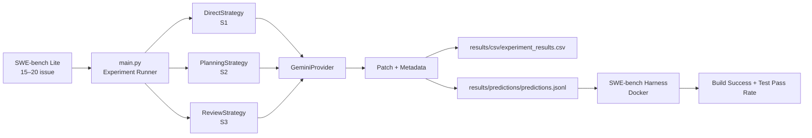

# 📘 Spec-Driven Development (SDD)
## AgentBench-SE — Analisis Trade-off Strategi Orkestrasi AI Agent

| Item | Description |
|------|-------------|
| **Judul** | Analisis Trade-off Strategi Orkestrasi AI Agent terhadap Efektivitas, Efisiensi, dan Biaya Inferensi dalam Tugas Bug Fixing Perangkat Lunak |
| **Peneliti** | Agi Rahman Setiadi |
| **Institusi** | Universitas Negeri Jakarta — Sistem dan Teknologi Informasi |
| **Status** | 🔧 Dalam Pengembangan |
| **Last Update** | July 2026 |

---

# Daftar Isi

1. [Project Overview](#1-project-overview)
2. [Arsitektur Sistem](#2-arsitektur-sistem)
3. [Spesifikasi Komponen](#3-spesifikasi-komponen)
4. [Role Specifications & Trade-off](#4-role-specifications--trade-off)
5. [Rencana Implementasi](#5-rencana-implementasi)
6. [Verifikasi & Eksperimen](#6-verifikasi--eksperimen)
7. [Task List](#7-task-list)
8. [Runbook Eksperimen](#8-runbook-eksperimen)
9. [Catatan Penting](#9-catatan-penting)

---

# 1. Project Overview

## 1.1 Research Context

Penelitian ini mengevaluasi **tiga strategi orkestrasi AI Agent** dalam menyelesaikan tugas *software bug fixing* menggunakan **model AI yang identik** sehingga perbedaan hasil hanya dipengaruhi oleh strategi orkestrasi, bukan kemampuan model.

### Research Questions

| RQ | Pertanyaan | Metrik |
|:--|:-----------|:-------|
| **RQ1** | Bagaimana perbedaan efektivitas antar strategi orkestrasi AI Agent dalam menyelesaikan tugas software bug fixing? | Build Success Rate, Test Pass Rate |
| **RQ2** | Bagaimana perbedaan efisiensi antar strategi orkestrasi AI Agent dalam menyelesaikan tugas software bug fixing? | Total Execution Time, Inference Count |
| **RQ3** | Bagaimana trade-off antara efektivitas, efisiensi, dan biaya inferensi pada setiap strategi orkestrasi AI Agent? | Prompt Tokens, Completion Tokens, Total Tokens |

## 1.2 Tiga Strategi

| Kode | Strategi | Agent | Inferensi |
|:----|:---------|:------|:----------|
| **S1** | Direct Execution | Executor saja | 1× |
| **S2** | Planning-based | Planner → Executor | 2× |
| **S3** | Planning + Review | Planner → Executor → Reviewer → (Executor Revisi) | 3–4× |

### Alur Kerja

#### S1 — Direct Execution
```
[Issue] ──► [Executor] ──► [Patch]
```

#### S2 — Planning-based
```
[Issue] ──► [Planner] ──► [Planning Document] ──► [Executor] ──► [Patch]
```

#### S3 — Planning + Review
```
[Issue] ──► [Planner] ──► [Planning Document] ──► [Executor] ──► [Initial Patch]
                                                                        │
                                                                        ▼
                                                                   [Reviewer]
                                                                        │
                                                                        ▼
                                                              [Structured Feedback]
                                                                        │
                                                                        ▼
                                                              [Executor Revision]
                                                                        │
                                                                        ▼
                                                                    [Final Patch]
```

## 1.3 Lingkungan Eksperimen

| Komponen | Spesifikasi |
|:---------|:------------|
| **Dataset** | SWE-bench Lite — 15–20 issue dari repo Django |
| **Model AI** | Gemini 2.0 Flash Lite (utama), Groq/Llama (fallback development) |
| **Evaluasi** | SWE-bench Harness (Docker) |
| **Temperature** | 0.2 |
| **Max Retries** | 3 |
| **Output** | CSV metrics + predictions JSONL |

---

# 2. Arsitektur Sistem

## 2.1 Diagram Alur



## 2.2 Struktur Direktori Final

```
D:\development\Skripsi2\AgantBech-SE\
│
├── .env                          # API keys & konfigurasi
├── requirements.txt              # Dependencies
├── sdd.md                        # ← Dokumen ini
│
├── datasets/
│   ├── swe_loader.py             # Load & filter SWE-bench dataset
│   ├── raw/                      # Cache HuggingFace dataset
│   └── processed/                # Selected issues (JSON)
│
├── src/
│   ├── main.py                   # Entry point CLI
│   ├── view_results.py           # Viewer hasil eksperimen
│   ├── dataset_loader.py         # Load SWE-bench Lite
│   ├── config.py                 # Load .env
│   │
│   ├── models/
│   │   ├── issue.py              # Issue dataclass
│   │   ├── patch.py              # Patch dataclass
│   │   └── result.py             # ExperimentResult dataclass
│   │
│   ├── providers/
│   │   ├── gemini_provider.py    # Gemini API wrapper + token tracking
│   │   └── groq_provider.py      # Groq API wrapper (fallback) + token tracking
│   │
│   ├── strategies/
│   │   ├── direct_strategy.py    # S1 — 1 agent
│   │   ├── planning_strategy.py  # S2 — 2 agent
│   │   └── review_strategy.py    # S3 — 3 agent
│   │
│   ├── evaluation/
│   │   └── evaluator.py          # (Diisi untuk validasi lokal opsional)
│   │
│   ├── experiments/
│   │   ├── runner.py             # Experiment orchestrator
│   │   └── swebench_adapter.py   # Konversi patch → predictions.jsonl
│   │
│   ├── prompts/
│   │   ├── direct_prompt.md      # Prompt S1
│   │   ├── planner.md            # Prompt Planner (S2, S3)
│   │   ├── executor.md           # Prompt Executor (S2, S3)
│   │   └── reviewer.md           # Prompt Reviewer (S3)
│   │
│   └── utils/
│       ├── logger.py             # Loguru config
│       └── prompt_loader.py      # Load prompt dari file
│
├── results/
│   ├── csv/                      # Experiment results
│   ├── logs/                     # Execution logs (kosong — lihat logs/agentbench.log)
│   ├── plot/                     # Visualizations (future)
│   ├── predictions/              # SWE-bench predictions JSONL
│   └── patches/                  # Raw patch files
│
└── tests/                        # (Kosong — tidak ada unit test khusus)
```

---

# 3. Spesifikasi Komponen

## 3.1 Models

### `src/models/issue.py`

```python
from dataclasses import dataclass

@dataclass
class Issue:
    instance_id: str        # "django__django-100"
    repo: str               # "django/django"
    base_commit: str        # commit hash (untuk SWE-bench eval)
    problem_statement: str  # deskripsi bug
    hints: str = ""         # hints (optional)

    def to_prompt(self) -> str:
        return (
            f"Instance ID: {self.instance_id}\n\n"
            f"Problem Statement:\n{self.problem_statement}"
        )
```

### `src/models/patch.py`

```python
from dataclasses import dataclass

@dataclass
class Patch:
    response: str         # output mentah dari LLM
    strategy: str = ""    # "direct" | "planning" | "review"
```

### `src/models/result.py`

```python
from dataclasses import dataclass

@dataclass
class ExperimentResult:
    instance_id: str
    strategy: str              # "direct" | "planning" | "review"
    execution_time: float      # detik
    inference_count: int
    prompt_tokens: int
    completion_tokens: int
    total_tokens: int
    patch_preview: str         # 100 karakter pertama patch
    error: str = ""
```

## 3.2 Providers

### `src/providers/gemini_provider.py`

```python
from google import genai
from google.genai import types
from config import Config
from utils.logger import logger


class GeminiProvider:
    def __init__(self):
        if not Config.GEMINI_API_KEY:
            raise ValueError("GEMINI_API_KEY tidak ditemukan pada file .env")
        self.client = genai.Client(api_key=Config.GEMINI_API_KEY)
        self.model = Config.GEMINI_MODEL
        self.last_usage = None

    def generate(self, prompt: str) -> str:
        try:
            response = self.client.models.generate_content(
                model=self.model,
                contents=prompt,
                config=types.GenerateContentConfig(
                    temperature=Config.TEMPERATURE,
                    http_options=types.HttpOptions(timeout=60000),
                ),
            )
            meta = response.usage_metadata
            self.last_usage = {
                "prompt_tokens": meta.prompt_token_count,
                "completion_tokens": meta.candidates_token_count,
                "total_tokens": meta.total_token_count,
            }
            return response.text
        except Exception as e:
            logger.error(f"Gemini Generate Error: {e}")
            raise

    def health_check(self) -> bool:
        try:
            self.generate("Reply with only: OK")
            logger.success("Gemini Health Check Passed")
            return True
        except Exception as e:
            logger.error(f"Gemini Health Check Failed: {e}")
            return False
```

### `src/providers/groq_provider.py`

```python
from openai import OpenAI
from config import Config
from utils.logger import logger


class GroqProvider:
    def __init__(self):
        if not Config.GROQ_API_KEY:
            raise ValueError("GROQ_API_KEY tidak ditemukan pada file .env")
        self.client = OpenAI(
            api_key=Config.GROQ_API_KEY,
            base_url="https://api.groq.com/openai/v1",
        )
        self.model = Config.GROQ_MODEL
        self.last_usage = None

    def generate(self, prompt: str) -> str:
        try:
            response = self.client.chat.completions.create(
                model=self.model,
                messages=[{"role": "user", "content": prompt}],
                temperature=Config.TEMPERATURE,
                timeout=60,
            )
            self.last_usage = {
                "prompt_tokens": response.usage.prompt_tokens,
                "completion_tokens": response.usage.completion_tokens,
                "total_tokens": response.usage.total_tokens,
            }
            return response.choices[0].message.content
        except Exception as e:
            logger.error(f"Groq Generate Error: {e}")
            raise

    def health_check(self) -> bool:
        try:
            self.generate("Reply with only: OK")
            logger.success("Groq Health Check Passed")
            return True
        except Exception as e:
            logger.error(f"Groq Health Check Failed: {e}")
            return False
```

## 3.3 Strategies

### `src/strategies/direct_strategy.py` — S1

```python
import time
from models.issue import Issue
from models.patch import Patch
from models.result import ExperimentResult
from utils.prompt_loader import load_prompt


class DirectStrategy:
    def __init__(self, provider):
        self.provider = provider

    def run(self, issue: Issue) -> tuple[Patch, ExperimentResult]:
        t0 = time.perf_counter()
        prompt = load_prompt("direct_prompt.md").replace("{{issue}}", issue.to_prompt())
        response = self.provider.generate(prompt)
        elapsed = time.perf_counter() - t0
        usage = self.provider.last_usage or {}

        patch = Patch(response=response, strategy="direct")
        result = ExperimentResult(
            instance_id=issue.instance_id,
            strategy="direct",
            execution_time=elapsed,
            inference_count=1,
            prompt_tokens=usage.get("prompt_tokens", 0),
            completion_tokens=usage.get("completion_tokens", 0),
            total_tokens=usage.get("total_tokens", 0),
            patch_preview=response[:100],
        )
        return patch, result
```

### `src/strategies/planning_strategy.py` — S2

```python
import time
from models.issue import Issue
from models.patch import Patch
from models.result import ExperimentResult
from utils.prompt_loader import load_prompt


class PlanningStrategy:
    def __init__(self, provider):
        self.provider = provider

    def run(self, issue: Issue) -> tuple[Patch, ExperimentResult]:
        inferences = 0
        total_time = 0.0
        total_prompt = 0
        total_completion = 0
        total_tokens = 0

        # Step 1: Planner
        t0 = time.perf_counter()
        plan_prompt = load_prompt("planner.md").replace("{{issue}}", issue.to_prompt())
        plan = self.provider.generate(plan_prompt)
        elapsed = time.perf_counter() - t0
        inferences += 1
        total_time += elapsed
        u = self.provider.last_usage or {}
        total_prompt += u.get("prompt_tokens", 0)
        total_completion += u.get("completion_tokens", 0)
        total_tokens += u.get("total_tokens", 0)

        # Step 2: Executor
        t0 = time.perf_counter()
        exec_prompt = (
            load_prompt("executor.md")
            .replace("{{issue}}", issue.to_prompt())
            .replace("{{plan}}", plan)
        )
        response = self.provider.generate(exec_prompt)
        elapsed = time.perf_counter() - t0
        inferences += 1
        total_time += elapsed
        u = self.provider.last_usage or {}
        total_prompt += u.get("prompt_tokens", 0)
        total_completion += u.get("completion_tokens", 0)
        total_tokens += u.get("total_tokens", 0)

        patch = Patch(response=response, strategy="planning")
        result = ExperimentResult(
            instance_id=issue.instance_id,
            strategy="planning",
            execution_time=total_time,
            inference_count=inferences,
            prompt_tokens=total_prompt,
            completion_tokens=total_completion,
            total_tokens=total_tokens,
            patch_preview=response[:100],
        )
        return patch, result
```

### `src/strategies/review_strategy.py` — S3

```python
import time
from models.issue import Issue
from models.patch import Patch
from models.result import ExperimentResult
from utils.prompt_loader import load_prompt


class ReviewStrategy:
    def __init__(self, provider):
        self.provider = provider

    def run(self, issue: Issue) -> tuple[Patch, ExperimentResult]:
        inferences = 0
        total_time = 0.0
        total_prompt = 0
        total_completion = 0
        total_tokens = 0

        # Step 1: Planner
        t0 = time.perf_counter()
        plan = self.provider.generate(
            load_prompt("planner.md").replace("{{issue}}", issue.to_prompt())
        )
        elapsed = time.perf_counter() - t0
        inferences += 1; total_time += elapsed
        u = self.provider.last_usage or {}
        total_prompt += u.get("prompt_tokens", 0)
        total_completion += u.get("completion_tokens", 0)
        total_tokens += u.get("total_tokens", 0)

        # Step 2: Executor (initial patch)
        t0 = time.perf_counter()
        exec_prompt = (
            load_prompt("executor.md")
            .replace("{{issue}}", issue.to_prompt())
            .replace("{{plan}}", plan)
        )
        initial_patch = self.provider.generate(exec_prompt)
        elapsed = time.perf_counter() - t0
        inferences += 1; total_time += elapsed
        u = self.provider.last_usage or {}
        total_prompt += u.get("prompt_tokens", 0)
        total_completion += u.get("completion_tokens", 0)
        total_tokens += u.get("total_tokens", 0)

        # Step 3: Reviewer
        t0 = time.perf_counter()
        review_prompt = (
            load_prompt("reviewer.md")
            .replace("{{issue}}", issue.to_prompt())
            .replace("{{plan}}", plan)
            .replace("{{patch}}", initial_patch)
        )
        feedback = self.provider.generate(review_prompt)
        elapsed = time.perf_counter() - t0
        inferences += 1; total_time += elapsed
        u = self.provider.last_usage or {}
        total_prompt += u.get("prompt_tokens", 0)
        total_completion += u.get("completion_tokens", 0)
        total_tokens += u.get("total_tokens", 0)

        # Step 4: Revisi jika reviewer tidak approve
        needs_revision = "APPROVED" not in feedback.upper()[:50]
        final_patch = initial_patch
        if needs_revision:
            t0 = time.perf_counter()
            revision_prompt = (
                load_prompt("executor.md")
                .replace("{{issue}}", issue.to_prompt())
                .replace("{{plan}}", plan)
                .replace("{{feedback}}", feedback)
            )
            final_patch = self.provider.generate(revision_prompt)
            elapsed = time.perf_counter() - t0
            inferences += 1; total_time += elapsed
            u = self.provider.last_usage or {}
            total_prompt += u.get("prompt_tokens", 0)
            total_completion += u.get("completion_tokens", 0)
            total_tokens += u.get("total_tokens", 0)

        patch = Patch(response=final_patch, strategy="review")
        result = ExperimentResult(
            instance_id=issue.instance_id,
            strategy="review",
            execution_time=total_time,
            inference_count=inferences,
            prompt_tokens=total_prompt,
            completion_tokens=total_completion,
            total_tokens=total_tokens,
            patch_preview=final_patch[:100],
        )
        return patch, result
```

## 3.4 Prompts

### `src/prompts/direct_prompt.md`

```markdown
You are an expert Python software engineer.

Your task is to fix the following bug.

{{issue}}

Analyze the root cause and provide a fix.

Output format:
## Root Cause
<explanation>

## Fix Strategy
<approach>

## Patch
```diff
--- a/file.py
+++ b/file.py
@@ ... @@
 ...
```
```

### `src/prompts/planner.md`

```markdown
You are a senior software engineer analyzing a bug. Do NOT write any code.

Bug Description:
{{issue}}

Your task is to create a structured analysis plan. Output in this exact format:

## Bug Summary
<one line summary>

## Root Cause Hypothesis
<detailed analysis of what causes the bug>

## Affected Files
- path/to/file.py (reason why this file needs changes)

## Repair Strategy
<step by step approach to fix the bug>

## Confidence
<High/Medium/Low>
```

### `src/prompts/executor.md`

```markdown
You are an expert Python developer implementing a bug fix.

Bug:
{{issue}}

Analysis Plan:
{{plan}}

Implement the fix following the plan above. Output only the patch.

## Patch
```diff
...
```
```

### `src/prompts/reviewer.md`

```markdown
You are a code reviewer evaluating a bug fix.

Bug:
{{issue}}

Plan:
{{plan}}

Proposed Patch:
{{patch}}

Review the patch and answer:
1. Does it correctly fix the described bug?
2. Does it follow the analysis plan?
3. Are there any edge cases or regressions?

Output:

## Review Summary
<evaluation>

## Issues Found
<list of issues or "None">

## Improvement Suggestions
<specific suggestions if any>

## Verdict
<APPROVED or NEEDS_REVISION>
```

## 3.5 Dataset Loader

### `datasets/swe_loader.py`

```python
from datasets import load_dataset
from models.issue import Issue


def load_swe_bench_lite() -> list[dict]:
    return load_dataset("princeton-nlp/SWE-bench_Lite", split="test")


def select_issues(repo_filter: str = "django", n: int = 15) -> list[Issue]:
    all_data = load_swe_bench_lite()
    filtered = [d for d in all_data if d["repo"].startswith(repo_filter)]
    selected = filtered[:n]
    return [
        Issue(
            instance_id=d["instance_id"],
            repo=d["repo"],
            base_commit=d["base_commit"],
            problem_statement=d["problem_statement"],
            hints=d.get("hints_text", ""),
        )
        for d in selected
    ]
```

## 3.6 SWE-bench Adapter

### `src/experiments/swebench_adapter.py`

```python
import re


def extract_diff(response: str) -> str:
    """Ekstrak konten diff dari response LLM."""
    for pattern in [r"```diff\n(.*?)```", r"```patch\n(.*?)```", r"```\n(.*?)```"]:
        match = re.search(pattern, response, re.DOTALL)
        if match:
            return match.group(1).strip()
    return response.strip()
```

## 3.7 Experiment Runner

### `src/experiments/runner.py`

```python
import json
import time
from pathlib import Path
import pandas as pd
from dataclasses import asdict
from models.issue import Issue
from models.result import ExperimentResult
from experiments.swebench_adapter import extract_diff
from utils.logger import logger


def run_experiments(
    issues: list[Issue],
    strategies: dict[str, object],
    output_dir: str = "results"
) -> pd.DataFrame:
    all_results: list[ExperimentResult] = []
    all_predictions: list[dict] = []
    Path(f"{output_dir}/patches").mkdir(parents=True, exist_ok=True)
    Path(f"{output_dir}/csv").mkdir(parents=True, exist_ok=True)
    Path(f"{output_dir}/predictions").mkdir(parents=True, exist_ok=True)

    total = len(issues) * len(strategies)
    done = 0

    for issue in issues:
        for name, strategy in strategies.items():
            done += 1
            logger.info(f"[{done}/{total}] Running {name} on {issue.instance_id}...")
            try:
                t0 = time.time()
                patch, result = strategy.run(issue)
                elapsed = time.time() - t0
                result.execution_time = elapsed
                all_results.append(result)

                diff = extract_diff(patch.response)
                all_predictions.append({
                    "instance_id": issue.instance_id,
                    "model_patch": diff,
                })

                Path(f"{output_dir}/patches/{issue.instance_id}_{name}.txt").write_text(
                    patch.response, encoding="utf-8"
                )
                logger.success(f"  OK ({elapsed:.1f}s, {result.total_tokens} tokens)")
            except Exception as e:
                logger.error(f"  FAILED: {e}")
                all_results.append(ExperimentResult(
                    instance_id=issue.instance_id,
                    strategy=name,
                    execution_time=0,
                    inference_count=0,
                    prompt_tokens=0,
                    completion_tokens=0,
                    total_tokens=0,
                    patch_preview="",
                    error=str(e),
                ))

    # Export CSV
    df = pd.DataFrame([asdict(r) for r in all_results])
    csv_path = f"{output_dir}/csv/experiment_results.csv"
    df.to_csv(csv_path, index=False)
    logger.success(f"CSV exported: {csv_path}")

    # Export predictions JSONL
    jsonl_path = f"{output_dir}/predictions/predictions.jsonl"
    with open(jsonl_path, "w", encoding="utf-8") as f:
        for pred in all_predictions:
            f.write(json.dumps(pred) + "\n")
    logger.success(f"Predictions exported: {jsonl_path} ({len(all_predictions)} entries)")

    return df
```

## 3.8 Main Entry Point

### `src/main.py`

```python
import argparse
from providers.gemini_provider import GeminiProvider
from strategies.direct_strategy import DirectStrategy
from strategies.planning_strategy import PlanningStrategy
from strategies.review_strategy import ReviewStrategy
from experiments.runner import run_experiments
from datasets.swe_loader import select_issues
from utils.logger import logger


def main():
    parser = argparse.ArgumentParser(description="AgentBench-SE Experiment Runner")
    parser.add_argument("--repo", default="django", help="Filter repo (default: django)")
    parser.add_argument("--n-issues", type=int, default=15, help="Number of issues (default: 15)")
    parser.add_argument("--output", default="results", help="Output directory")
    parser.add_argument("--provider", default="gemini", choices=["gemini", "groq"])
    args = parser.parse_args()

    # Init provider
    if args.provider == "gemini":
        from providers.gemini_provider import GeminiProvider as Provider
    else:
        from providers.groq_provider import GroqProvider as Provider

    provider = Provider()
    if not provider.health_check():
        logger.error("Health check failed — aborting")
        return

    # Load dataset
    logger.info(f"Loading SWE-bench Lite — repo={args.repo}, n={args.n_issues}")
    issues = select_issues(repo_filter=args.repo, n=args.n_issues)
    logger.info(f"Loaded {len(issues)} issues")

    # Init strategies
    strategies = {
        "direct": DirectStrategy(provider),
        "planning": PlanningStrategy(provider),
        "review": ReviewStrategy(provider),
    }

    # Run
    df = run_experiments(issues, strategies, args.output)

    # Summary
    summary = df.groupby("strategy")[
        ["execution_time", "inference_count", "total_tokens"]
    ].mean()
    print("\n=== SUMMARY ===")
    print(summary.to_string())


if __name__ == "__main__":
    main()
```

---

# 4. Role Specifications & Trade-off

## 4.1 Scope Tiap Role

### Planner

| Aspek | Spesifikasi |
|:------|:------------|
| ✅ **Boleh** | Membaca problem statement |
| | Menganalisis root cause |
| | Mengidentifikasi file yang terdampak |
| | Menyusun repair strategy |
| | Mengumpulkan evidence dari problem statement |
| | Output berupa Planning Document (TEKS) |
| ❌ **Tidak boleh** | Menulis kode / patch |
| | Memodifikasi repository |
| | Menjalankan build / test |
| | Mengevaluasi patch (tugas Reviewer) |
| | Merevisi pekerjaan Executor |
| **Output** | **Planning Document** — analisis terstruktur (bukan kode) |

### Executor

| Aspek | Spesifikasi |
|:------|:------------|
| ✅ **Boleh** | Membaca problem statement |
| | Membaca Planning Document (jika tersedia) |
| | Menulis kode / patch |
| | Merevisi patch berdasarkan Reviewer feedback (S3) |
| | Output berupa Patch (KODE) |
| ❌ **Tidak boleh** | Melakukan analisis mendalam (tugas Planner) |
| | Mengevaluasi patch sendiri |
| | Menjalankan build / test |
| | Mengubah lingkup issue |
| | Menambahkan fitur di luar bug fix |
| **Output** | **Patch** — diff/patch kode siap pakai |

### Reviewer

| Aspek | Spesifikasi |
|:------|:------------|
| ✅ **Boleh** | Membaca problem statement |
| | Membaca Planning Document |
| | Membaca patch hasil Executor |
| | Memberikan structured feedback |
| | Menentukan apakah patch perlu revisi |
| | Output berupa Review Feedback (TEKS) |
| ❌ **Tidak boleh** | Menulis kode / patch |
| | Memodifikasi patch (hanya memberi saran) |
| | Menjalankan build / test |
| | Menentukan hasil akhir eksperimen (itu tugas Evaluation Engine) |
| **Output** | **Review Feedback** — issue, saran, verdict (APPROVED / NEEDS_REVISION) |

## 4.2 Perbedaan Output Per Strategi (Trade-off)

### S1 — Direct Execution

```
[Executor] → output: Patch (KODE)
```

| Metrik | Konsekuensi |
|:-------|:------------|
| **Inferensi** | 1× — **paling sedikit** ⚡ |
| **Token** | **Paling rendah** 💰 |
| **Execution Time** | **Paling cepat** ⏱️ |
| **Efektivitas** | Berpotensi rendah — Executor harus analisis + coding sendiri, rentan misinterpretasi |
| **Output unik** | Hanya Patch — tidak ada jejak analisis |

### S2 — Planning-based

```
[Planner] → Planning Document (TEKS)
    ↓
[Executor] → Patch (KODE)
```

| Metrik | Konsekuensi |
|:-------|:------------|
| **Inferensi** | 2× — sedang |
| **Token** | Sedang — ada overhead analisis Planner |
| **Execution Time** | Sedang — 2 call API sequential |
| **Efektivitas** | Berpotensi lebih tinggi — Executor bekerja berdasarkan rencana terstruktur |
| **Output unik** | Planning Document + Patch — ada jejak analisis yang bisa diverifikasi |

### S3 — Planning + Review

```
[Planner] → Planning Document (TEKS)
    ↓
[Executor] → Initial Patch (KODE)
    ↓
[Reviewer] → Review Feedback (TEKS)
    ↓
[Executor] → Final Patch (KODE) [jika revisi diperlukan]
```

| Metrik | Konsekuensi |
|:-------|:------------|
| **Inferensi** | 3–4× — **terbanyak** 🐢 |
| **Token** | **Tertinggi** 💸 — overhead Planner + Reviewer + revisi |
| **Execution Time** | **Terlama** ⏳ |
| **Efektivitas** | Berpotensi tertinggi — ada quality assurance internal sebelum evaluasi |
| **Output unik** | Planning Document + Patch + Review Feedback — siklus QA lengkap |

## 4.3 Tabel Perbandingan Trade-off

| Aspek | S1 (Direct) | S2 (Planning) | S3 (Review) |
|:------|:-----------:|:-------------:|:-----------:|
| **Agent** | Executor | Planner → Executor | Planner → Executor → Reviewer |
| **Analisis terpisah** | ❌ Tidak | ✅ Ya | ✅ Ya |
| **QA Internal** | ❌ Tidak | ❌ Tidak | ✅ Reviewer |
| **Revisi** | ❌ Tidak | ❌ Tidak | ✅ Jika perlu |
| **Inference Count** | **1** ⚡ | **2** | **3–4** 🐢 |
| **Token Usage** | **Rendah** 💰 | Sedang | **Tinggi** 💸 |
| **Execution Time** | **Cepat** ⏱️ | Sedang | **Lambat** ⏳ |
| **Efektivitas (ekspektasi)** | ? | ? | ? (diharapkan tertinggi) |
| **Output** | Patch saja | Plan + Patch | Plan + Patch + Feedback |

## 4.4 Contoh Output Nyata (Issue yang Sama)

Misal issue: `django__django-100` — Admin login throws 500 error

### Output S1
```
## Root Cause
Missing CSRF token handling in admin login view

## Fix Strategy
Add @csrf_protect decorator to the login view

## Patch
```diff
--- a/django/contrib/admin/sites.py
+++ b/django/contrib/admin/sites.py
@@ -120,6 +120,8 @@
 ...
```
```

### Output S2
```
=== Planning Document ===
Bug Summary: Admin login throws 500 on POST
Root Cause: CSRF token missing
Affected Files: django/contrib/admin/sites.py
Repair Strategy: Add @csrf_protect decorator

=== Patch ===
[similar diff as S1]
```

### Output S3
```
=== Planning Document ===
[same as S2]

=== Initial Patch ===
[same as S2]

=== Review Feedback ===
Review Summary: Patch looks correct but needs CSRF middleware check
Issues Found: None critical
Verdict: APPROVED

=== Final Patch ===
[same as Initial Patch — no revision needed]
```

Perbedaan output inilah yang menciptakan **trade-off**:
- **S1**: Cepat & murah, tapi tidak ada transparansi proses
- **S2**: Biaya lebih tinggi, tapi ada artefak analisis yang bisa diperiksa
- **S3**: Paling mahal & lambat, tapi ada jaminan kualitas internal

Pertanyaan penelitian akan dijawab dengan mengkuantifikasi:
- **RQ1**: Apakah S3 benar-benar menghasilkan patch yang lebih valid?
- **RQ2**: Seberapa besar tambahan waktu & token untuk S2 dan S3?
- **RQ3**: Apakah peningkatan efektivitas sebanding dengan biaya tambahan?

---

# 5. Rencana Implementasi

## Tahap 1: Foundation (Models + Provider Token Tracking)

| Step | File | Deskripsi |
|:----|:-----|:----------|
| 1.1 | `models/issue.py` | Tambah field `instance_id`, `repo`, `base_commit`, `hints` |
| 1.2 | `models/result.py` | Create `ExperimentResult` dataclass |
| 1.3 | `models/plan.py` | **Hapus** (stub) |
| 1.4 | `models/evaluation.py` | **Hapus** (stub) |
| 1.5 | `providers/gemini_provider.py` | Tambah `last_usage` attribute |
| 1.6 | `providers/groq_provider.py` | Tambah `last_usage` attribute |

**Verifikasi:** Setelah `generate()`, `provider.last_usage != None`.

## Tahap 2: Prompts

| Step | File | Deskripsi |
|:----|:-----|:----------|
| 2.1 | `prompts/direct_prompt.md` | Refine format output agar konsisten |
| 2.2 | `prompts/planner.md` | Create — prompt untuk analisis bug |
| 2.3 | `prompts/executor.md` | Create — prompt untuk implementasi patch |
| 2.4 | `prompts/reviewer.md` | Create — prompt untuk review patch |

**Verifikasi:** `load_prompt(filename)` return string dengan placeholder `{{issue}}`, `{{plan}}`, dll.

## Tahap 3: Strategies

| Step | File | Deskripsi |
|:----|:-----|:----------|
| 3.1 | `strategies/direct_strategy.py` | Modify — tambah timing + return result |
| 3.2 | `strategies/planning_strategy.py` | Create — Planner → Executor |
| 3.3 | `strategies/review_strategy.py` | Create — Planner → Executor → Reviewer → Revisi |

**Verifikasi:** `strategy.run(issue)` return `(Patch, ExperimentResult)` dengan data valid.

## Tahap 4: Dataset + Runner

| Step | File | Deskripsi |
|:----|:-----|:----------|
| 4.1 | `datasets/swe_loader.py` | Create — load SWE-bench Lite via HuggingFace |
| 4.2 | `experiments/swebench_adapter.py` | Create — diff extraction |
| 4.3 | `experiments/runner.py` | Create — orchestrator eksperimen |
| 4.4 | `main.py` | Create — CLI entry point |

**Verifikasi:** `python src/main.py --n-issues 2` selesai tanpa error, CSV terisi.

## Tahap 5: Full Experiment

| Step | Aksi | Verifikasi |
|:----|:-----|:-----------|
| 5.1 | `pip install swebench datasets pandas` | Semua dependencies terinstall |
| 5.2 | `python src/main.py --n-issues 15` | CSV = 45 baris (15 issue × 3 strategi) |
| 5.3 | Cek `results/predictions/predictions.jsonl` | Format valid, ada field `instance_id` + `model_patch` |
| 5.4 | SWE-bench eval | `python -m swebench.harness.run_evaluation ...` |

## Tahap 6: Analisis

| Step | Aksi |
|:----|:-----|
| 6.1 | Buka CSV di Excel / Google Sheets |
| 6.2 | Hitung rata-rata `execution_time` per strategi |
| 6.3 | Hitung rata-rata `total_tokens` per strategi |
| 6.4 | Hitung rata-rata `inference_count` per strategi |
| 6.5 | Bandingkan `build_success` dari hasil SWE-bench |
| 6.6 | Buat bar chart perbandingan |
| 6.7 | Jawab RQ1, RQ2, RQ3 |

---

# 6. Verifikasi & Eksperimen

## 6.1 Verifikasi Komponen

| Komponen | Cara Verifikasi |
|:---------|:----------------|
| Provider health check | `provider.health_check()` return True |
| Token tracking | Setelah `generate()`, cek `provider.last_usage` tidak None |
| Load prompt | `load_prompt("direct_prompt.md")` return string valid |
| Direct strategy | `run(issue)` selesai < 30 detik, return Patch non-kosong |
| Planning strategy | `inference_count=2`, total_tokens > direct |
| Review strategy | `inference_count` antara 3–4 |
| Dataset loader | `select_issues("django", 5)` return list of 5 Issue |
| Diff extraction | `extract_diff(response)` return string diff (tidak kosong) |
| CSV export | File `experiment_results.csv` punya header & data |

## 6.2 Verifikasi Eksperimen

| Eksperimen | Langkah | Expected |
|:-----------|:--------|:---------|
| Dry run (2 issue) | `python src/main.py --n-issues 2` | Selesai < 5 menit, CSV 6 baris |
| Full run (15 issue) | `python src/main.py --n-issues 15` | Selesai < 45 menit, CSV 45 baris |
| SWE-bench eval | `python -m swebench.harness.run_evaluation ...` | Setiap instance punya `build_success` + `test_pass_rate` |

---

# 7. Task List

## ✅ Sudah Selesai

| No | Task | File |
|:---|:-----|:-----|
| 1 | Struktur proyek folder | Seluruh folder `src/`, `datasets/`, `results/` |
| 2 | Config loader (.env) | `src/config.py` |
| 3 | Logging (loguru) | `src/utils/logger.py` |
| 4 | Prompt loader | `src/utils/prompt_loader.py` |
| 5 | Issue model (lengkap) | `src/models/issue.py` |
| 6 | Patch model | `src/models/patch.py` |
| 7 | Result model + model & timestamp | `src/models/result.py` |
| 8 | Gemini provider + token tracking | `src/providers/gemini_provider.py` |
| 9 | Groq provider + token tracking | `src/providers/groq_provider.py` |
| 10 | Direct strategy + timing | `src/strategies/direct_strategy.py` |
| 11 | Planning strategy | `src/strategies/planning_strategy.py` |
| 12 | Review strategy | `src/strategies/review_strategy.py` |
| 13 | Prompt direct | `src/prompts/direct_prompt.md` |
| 14 | Planner prompt | `src/prompts/planner.md` |
| 15 | Executor prompt | `src/prompts/executor.md` |
| 16 | Reviewer prompt | `src/prompts/reviewer.md` |
| 17 | SWE-bench loader | `src/dataset_loader.py` |
| 18 | Diff extractor | `src/experiments/swebench_adapter.py` |
| 19 | Experiment runner + rate limiting | `src/experiments/runner.py` |
| 20 | Main CLI | `src/main.py` |
| 21 | view_results.py | `src/view_results.py` |
| 22 | `.env` config | API keys, model, temperature |
| 23 | `.gitignore` | Env, cache, logs |
| 24 | `requirements.txt` | Dependencies |
| 25 | SDD document | `sdd.md` ← Dokumen ini |
| 26 | Dependencies install | swebench, datasets, pandas, loguru |
| 27 | Delete stub models | `models/plan.py`, `evaluation.py` |
| 28 | Package init files | `src/models/__init__.py`, dll |
| 29 | Dry run (1 issue) | ✅ Verified |
| 30 | Testing run (10 issues, Groq) | ✅ 28/30 success |

## 🔄 Refactor Selesai (Feedback Dosen)

| No | Task | Status | Kritik Dosen |
|:---|:-----|:-------|:-------------|
| 31 | InferenceResult model + ExperimentResult refactor | ✅ Selesai | #1, #4 |
| 32 | Provider generate() → return InferenceResult (hapus last_usage) | ✅ Selesai | #1, #2, #3 |
| 33 | Strategies adapt InferenceResult + InferenceRun | ✅ Selesai | #1, #4 |
| 34 | Artifact saving (planner/reviewer/executor per issue) | ✅ Selesai | #6, #7 |
| 35 | Prompt JSON format + extract_diff() parser | ✅ Selesai | #5 |
| 36 | experiment.yaml reproducibility config | ✅ Selesai | #8 |
| 37 | Dry run verification after refactor | ✅ Selesai | — |

## 🔄 Dalam Progress

| No | Task | Status | Prioritas |
|:---|:-----|:-------|:----------|
| 38 | Final run (15 issues, Gemini) | ⏳ Ready to execute | 🔴 P0 |
| 39 | Analisis CSV → RQ1, RQ2, RQ3 | ⏳ After final run | 🔴 P0 |

## ⚠️ Skipped

| No | Task | Reason |
|:---|:-----|:-------|
| 40 | SWE-bench evaluation (Docker) | Low RAM (8GB), Docker build terlalu berat |

**Progress: 37/40 tasks (92%) — 2 tasks remaining (1 skipped)**

---

# 8. Runbook Eksperimen

```bash
# ──────────────────────────────────
# 0. Setup Environment
# ──────────────────────────────────
pip install -r requirements.txt
pip install swebench datasets pandas

# ──────────────────────────────────
# 1. Cek Health Provider
# ──────────────────────────────────
python -c "
from providers.gemini_provider import GeminiProvider
p = GeminiProvider()
print('Gemini:', p.health_check())
"

# ──────────────────────────────────
# 2. Dry Run (2 issue — verifikasi)
# ──────────────────────────────────
python src/main.py --n-issues 2 --output results/dry_run

# ──────────────────────────────────
# 3. Full Experiment (15 issue)
# ──────────────────────────────────
python src/main.py --n-issues 15 --output results/full_run

# ──────────────────────────────────
# 4. SWE-bench Evaluation (Docker)
# ──────────────────────────────────
python -m swebench.harness.run_evaluation \
    --dataset_name princeton-nlp/SWE-bench_Lite \
    --predictions_path results/full_run/predictions/predictions.jsonl \
    --max_workers 2 \
    --run_id agentbench-full

# ──────────────────────────────────
# 5. Lihat Hasil
# ──────────────────────────────────
ls results/full_run/csv/
ls results/full_run/patches/ | head
ls results/full_run/predictions/
```

---

# 9. Catatan Penting

## Token Usage di Gemini API
Gemini `generate_content()` mengembalikan `response.usage_metadata`:
- `prompt_token_count` — token input
- `candidates_token_count` — token output
- `total_token_count` — total

Simpan setelah setiap `generate()`:
```python
self.last_usage = {
    "prompt_tokens": response.usage_metadata.prompt_token_count,
    "completion_tokens": response.usage_metadata.candidates_token_count,
    "total_tokens": response.usage_metadata.total_token_count,
}
```

## Docker untuk SWE-bench
Pertama kali menjalankan SWE-bench harness akan **membangun Docker images** untuk setiap repo. Ini bisa memakan waktu 30–60 menit tergantung koneksi internet.

Gunakan `--instance_ids` untuk evaluasi spesifik:
```bash
python -m swebench.harness.run_evaluation \
    --predictions_path predictions.jsonl \
    --instance_ids django__django-100 django__django-101 \
    --max_workers 1
```

## Fallback Provider
Groq digunakan hanya jika Gemini sedang rate-limited atau quota habis. Untuk konsistensi penelitian, **semua eksperimen utama harus pakai Gemini**. Groq hanya untuk testing saat development.

## Desain Minimal
Proyek ini sengaja dibuat **tanpa abstract class, tanpa complex controller, tanpa Docker untuk strategi**. Setiap strategi adalah kelas mandiri yang memanggil provider secara sequential. Ini cukup untuk menjawab RQ1, RQ2, RQ3 tanpa overengineering.

---

# 10. Future Enhancements

## 10.1 `view_results.py` — Full Patch & Diff Viewer

**Status:** ✅ `list`, `summary`, `compare`, `errors`, `patch` sudah ada di `src/view_results.py`

### Enhancement: `view_results.py diff <issue_id>`

Baca full response dari `results/patches/<issue_id>_<strategy>.txt` (bukan cuma preview 100 karakter).

```bash
python src/view_results.py diff django__django-10914
# Output full response per strategi
```

### Enhancement: `view_results.py side-by-side <issue_id>`

Tabel komparasi teknis antar strategi untuk satu issue:

```
Strategy    │ Direct        │ Planning      │ Review
────────────┼───────────────┼───────────────┼───────────────
Time        │ 2.6s          │ 3.4s          │ 8.5s
Tokens      │ 984           │ 1793          │ 5046
Inferences  │ 1             │ 2             │ 4
Patch file  │ django_direct │ django_plan   │ django_review
```

## 10.2 Simpan Artifact per Agent

**Saat ini:** `runner.py` hanya menyimpan final patch.

**Ke depannya:**

| Strategi | Artifact yang Disimpan | File |
|:---------|:----------------------|:-----|
| S1 (Direct) | Final patch (✓ sudah) | `<id>_direct.txt` |
| S2 (Planning) | Planning Document + Final patch | `<id>_planning_plan.txt`, `<id>_planning_patch.txt` |
| S3 (Review) | Planning Doc + Initial Patch + Review Feedback + Final Patch | 4 file terpisah |

### Perubahan yang Diperlukan

| File | Perubahan |
|:-----|:----------|
| `strategies/planning_strategy.py` | Return terpisah: `(plan_artifact, patch, result)` |
| `strategies/review_strategy.py` | Return terpisah: `(plan, initial_patch, feedback, final_patch, result)` |
| `experiments/runner.py` | Simpan setiap artifact ke file terpisah |
| `view_results.py` | Baca artifact dari file untuk mode `diff` dan `side-by-side` |

## 10.3 Visualisasi

| Grafik | Tujuan | File |
|:-------|:-------|:-----|
| Bar chart | Build Success Rate antar strategi | `results/plot/` |
| Box plot | Distribusi execution time | `results/plot/` |
| Bar chart | Rata-rata token usage | `results/plot/` |
| Scatter plot | Trade-off effectiveness vs cost | `results/plot/` |

## 10.4 Prioritas Enhancement

| Prioritas | Enhancement | Estimasi |
|:----------|:------------|:---------|
| P1 | Simpan artifact per agent (planning & review) | 1 jam |
| P1 | `view_results.py diff` — baca file full patch | 30 menit |
| P2 | `view_results.py side-by-side` | 30 menit |
| P2 | Visualisasi dasar (bar chart) | 1 jam |
| P3 | Visualisasi lengkap + analisis | 2 jam |
